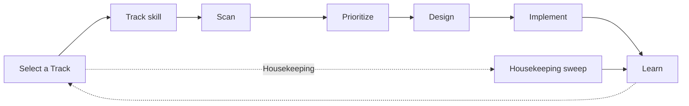

# Continuous Refactoring

> Paying down technical debt. Now. Automatically.

[](https://github.com/Art4/continuous-refactoring/actions/workflows/test-harness.yml)
[](https://github.com/Art4/continuous-refactoring/actions/workflows/skills-validation.yml)
[](LICENSE)

🌐 [continuous-refactoring.de](https://continuous-refactoring.de/)

A portable agent-skill suite for [Claude Code](https://claude.com/claude-code) that keeps a
software project under **continuous refactoring**: scan, prioritise, design, implement, learn —
on repeat, as a stateful, repeatable loop instead of a one-shot action.



Each invocation is one **loop pass**: pick the Track that is due, run it, record what was learned. The very first invocation on a project is the exception: it only **onboards** the project (a short interview, a few setup files) and stops. A thin data pipe carries each skill's output to the next skill's input — no skill re-derives its own context from shared state.

The core is [language-neutral](skills/refactor-scan/references/tooling-tree.md); the first specialization is a **[general PHP project](skills/refactor-scan/references/php-tooling-tree.md)** (code style, Rector, PHPStan via the tooling tree), grounded in over 20 years of PHP experience and kept up to date with current best practice.

## How it works

A pass spends itself on exactly one of four **Tracks**. Each has its own cadence in the bookkeeping document — an interval with a unit (`12 hours`, `7 days`, `2 weeks`, `1 month`) or a monthly calendar day (`monthly on the 1st`); the most overdue one wins.

| Track | What it does | Default cadence |
|---|---|---|
| **Safety Net** | Adopts the deterministic checks (test runner, coding standards, static analysis, CI) that catch a regression before an agent's own judgement has to | 90 days |
| **Guardrails** | Adds further quality and security tooling once the Safety Net is in place (dependency audit, coverage floor, mess detection, …) | 60 days |
| **Housekeeping** | Recurring maintenance sweep — dependency currency, tooling-deprecation cleanup, documentation sync | 7 days |
| **Investigation** | Finds and delivers one structural refactoring candidate (hot spots, deepening opportunities) at a time | always due, lowest priority |

Tickets are created by the loop only — automatically, or after asking you (`Ticket-create-mode`). While a pass runs, the loop tells you what it is doing — a sentence before and after every step, and one line per change to your repository (issue, branch, merge request). Tracks that adopt tooling work through their open items one node per pass, top to bottom; a Track that still has open work is finished before it is rescanned. Structural work only opens once the Safety Net is in place. At most two suite merge requests are open at any time. Details: [Track playbook](docs/playbooks/tracks.md) and [Architecture](docs/architecture.md).

## Skills

| Skill | Purpose |
|---|---|
| `continuous-refactoring` | The one entry point — a thin dispatcher: onboards a project that has never run the loop, otherwise selects the Track due this pass (cadence or on-demand) and hands it to that Track's skill |
| `refactor-scan` | Propose every currently-unblocked tooling-tree node from the bookkeeping document; detect (never file) closed/merged issues and MRs |
| `refactor-prioritize` | Rank the proposals, recommend the next one — for a gate-shaped winner, also selects the concrete candidate; drafts the tickets the loop then creates |
| `refactor-design` | Ground/grill the candidate → plan, written or commented onto its ticket |
| `refactor-implement` | Execute the plan test-first, in slices, review included |
| `refactor-learn` | The suite's only writer — ledger, ADR/CONTEXT.md, issue status |

Internally, `continuous-refactoring` dispatches to a per-Track skill — `continuous-safety-net`, `continuous-guardrails`, `continuous-investigation` (all three delegate to the track-agnostic `refactor-loop`, which runs scan → prioritise → design → implement → learn) and `continuous-housekeeping` (owns Housekeeping's own process). They are implementation detail, not entry points — invoke `/continuous-refactoring`.

## Installing in a target project

The suite makes no assumptions about the target repo beyond the issue-tracker convention. Install via symlink:

```bash
ln -s /path/to/continuous-refactoring/skills/* <target>/.agents/skills/
```

Or copy. To make the suite globally available (e.g. in `~/.config/opencode/skills/`), a symlink on the `skills/` directories there is enough.

> **Recommended, not required — the engineering-skills setup.** `setup-matt-pocock-skills` from [mattpocock/skills](https://github.com/mattpocock/skills) (see [aihero.dev](https://www.aihero.dev/)) configures the issue tracker, triage labels and domain docs the suite reads. Run it first if you can. Without it the first `/continuous-refactoring` notices, asks whether to stop and set it up or to continue, and writes a minimal issue-tracker file and label table itself; running the setup later updates those files in place.

## Quick start

1. **Start the loop:** `/continuous-refactoring` — on a project that has never run it, this first invocation only **onboards**: a short config interview, then it writes your config file, the bookkeeping document (both under `.scratch/refactor/`) and the other setup files, tells you what it did, and stops without scanning anything. Commit what belongs in Git (the instruction-file section and `docs/agents/*`), then run `/continuous-refactoring` again — that second invocation starts the first real pass. The loop has no cadence of its own; trigger it however often fits (by hand, or your own scheduler such as `/schedule` or `/loop`). Each pass picks whichever of the four Tracks is most overdue and works that one — Housekeeping's weekly sweep needs no separate opt-in step.
2. **Optional — force a specific Track:** name one directly when invoking `/continuous-refactoring` (e.g. "run the Housekeeping Track") to bypass the scheduler's own staleness comparison for this pass.
3. **Review and merge** the merge requests the loop opens. With two already open, a pass ends without new work until you merge or close one.

## Loop state

Everything lives in the target repo's working tree, not in the conversation. The suite never commits its own state. By default it is written as local files — whether they go into Git, and how they reach another machine, is up to you (meant for one person); or you keep the bookkeeping in a tracker issue, which any machine can pick up:

- **Your config:** `.scratch/refactor/config.md` — where the bookkeeping lives, `Ticket-create-mode` and `MR-create-mode`; per person and machine
- **Last run:** `.scratch/refactor/bookkeeping.md`, or one tracker issue if you chose that during onboarding — each Track's cadence, last scan and open items
- **Focus areas and refactoring goal:** two lines you add to `AGENTS.md` (or `CLAUDE.md`), any time
- **Remembered merge requests:** open `refactor:candidate` issues with a linked pull request; `.scratch/refactor/merge-requests.md` on trackers without native labels
- **Backlog:** `refactor:*` issues on the issue tracker
- **Learned rejections:** `.scratch/refactor/out-of-scope/`
- **Domain language and decisions:** the target's own `CONTEXT.md` and ADR directory
- **Housekeeping checklist** (only once some node has contributed to it): `docs/refactoring/housekeeping-template.md`

## Documentation

| Doc | For |
|---|---|
| [Loop playbook](docs/playbooks/loop.md) | Steering the loop as a human — triggers, what you decide each pass |
| [Track playbook](docs/playbooks/tracks.md) | How the four Tracks are scheduled, worked and overridden |
| [Housekeeping playbook](docs/playbooks/housekeeping.md) | The maintenance Track — cadence, reading a sweep |
| [Reviewer-loop playbook](docs/playbooks/reviewer-loop.md) | Observing a run from a separate reviewer agent |
| [Architecture](docs/architecture.md) | Skill hierarchy, data flow, loop state, tooling tree |
| [FAQ](docs/FAQ.md) | Why the suite is designed the way it is |
| [Known limitations](docs/known-limitations.md) | Setup gotchas without a suite-side fix, plus troubleshooting |
| [Bookkeeping reference](skills/continuous-refactoring/references/refactoring-bookkeeping.md) | The config file and the bookkeeping document in full |
| [CONTEXT.md](CONTEXT.md) | The suite's vocabulary |

## Contributing

Bug reports, feature requests, and pull requests are welcome — see [CONTRIBUTING.md](CONTRIBUTING.md).

## License

MIT — see [LICENSE](LICENSE).

---

Built by [Artur Weigandt](https://weigandtlabs.de) — PHP refactoring, freelance.