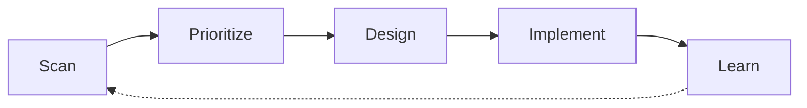

# Continuous Refactoring

> Paying down technical debt. Now. Automatically.

[](https://github.com/Art4/continuous-refactoring/actions/workflows/test-harness.yml)
[](https://github.com/Art4/continuous-refactoring/actions/workflows/skills-validation.yml)
[](LICENSE)

🌐 [continuous-refactoring.de](https://continuous-refactoring.de/)

A portable agent-skill suite for [Claude Code](https://claude.com/claude-code) that keeps a
software project under **continuous refactoring**: scan, prioritise, design, implement, learn —
on repeat, as a stateful, repeatable loop instead of a one-shot action.



The orchestrator carries each skill's output to the next skill's input — no skill re-derives its own context from shared state.

The core is [language-neutral](skills/refactor-scan/references/tooling-tree.md); the first specialization is a **[general PHP project](skills/refactor-scan/references/php-tooling-tree.md)** (code style, Rector, PHPStan via the tooling tree), grounded in over 20 years of PHP experience and kept up to date with current best practice.

## Skills

| Skill | Purpose |
|---|---|
| `continuous-refactoring` | Orchestrator — runs a loop pass (cadence or on-demand), passes each skill's output to the next |
| `refactor-scan` | Propose every currently-unblocked tooling-tree node from `bookkeeping.md`; detect (never file) closed/merged issues and MRs |
| `refactor-prioritize` | Rank the proposals, recommend the next one — for a gate-shaped winner, also selects and files the concrete candidate |
| `refactor-design` | Ground/grill the candidate → plan, filed or commented onto its issue |
| `refactor-implement` | Execute the plan test-first, in slices, review included |
| `refactor-learn` | The suite's only writer — ledger, ADR/CONTEXT.md, issue status |

The orchestrator also runs a recurring maintenance sweep — dependency currency, tooling-deprecation
cleanup, documentation sync — as its own **Housekeeping Track**, scheduled alongside three other Tracks
(Safety Net, Guardrails, Investigation) rather than as a separate skill you have to remember to invoke.
See [Quick start](#quick-start), below.

## Installing in a target project

The suite makes no assumptions about the target repo beyond the issue-tracker convention. Install via symlink:

```bash
ln -s /path/to/continuous-refactoring/skills/* <target>/.agents/skills/
```

Or copy. To make the suite globally available (e.g. in `~/.config/opencode/skills/`), a symlink on the `skills/` directories there is enough.

The target project needs the engineering-skills setup (`setup-matt-pocock-skills` from [mattpocock/skills](https://github.com/mattpocock/skills), see [aihero.dev](https://www.aihero.dev/): issue-tracker config, triage labels, domain docs). If it's missing, the orchestrator points that out.

## Quick start

1. **Start the loop:** `/continuous-refactoring` — the orchestrator scaffolds `docs/refactoring/` and runs the first pass. No cadence of its own; trigger it however often fits (by hand, or your own scheduler). Each pass picks whichever of the four Tracks — Safety Net, Guardrails, Housekeeping, Investigation — is most overdue and works that one; Housekeeping's own recurring maintenance sweep (dependency currency, tooling-deprecation fixes) is scheduled the same way, weekly by default, with no separate opt-in step.
2. **Optional — force a specific Track:** name one directly when invoking `/continuous-refactoring` (e.g. "run the Housekeeping Track") to bypass the scheduler's own staleness comparison for this pass.

## Loop state

- **Config + last run:** `docs/refactoring/bookkeeping.md` in the target repo
- **Remembered merge requests:** `docs/refactoring/merge-requests.md`
- **Backlog:** `refactor:*` issues on the issue tracker
- **Learned rejections:** `docs/refactoring/out-of-scope/`
- **Domain language:** `CONTEXT.md` · decisions: `docs/adr/`
- **Housekeeping checklist** (only once some node has contributed to it): `docs/refactoring/housekeeping-template.md` — see the [housekeeping playbook](docs/playbooks/housekeeping.md)

See [Playbooks](docs/playbooks/loop.md) for steering the loop as a human ([housekeeping](docs/playbooks/housekeeping.md) has its own) and [skills/continuous-refactoring/references/refactoring-bookkeeping.md](skills/continuous-refactoring/references/refactoring-bookkeeping.md) for the config file.

See [Known limitations](docs/known-limitations.md) for setup gotchas that don't have a suite-side fix (e.g. GitHub App permission scopes), and the [FAQ](docs/FAQ.md) for why the suite is designed the way it is.

## Contributing

Bug reports, feature requests, and pull requests are welcome — see [CONTRIBUTING.md](CONTRIBUTING.md).

## License

MIT — see [LICENSE](LICENSE).

---

Built by [Artur Weigandt](https://weigandtlabs.de) — PHP refactoring, freelance.