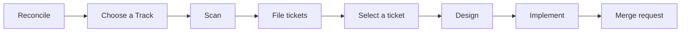

# Continuous Refactoring

> Paying down technical debt. Now. Automatically.

[](https://github.com/Art4/continuous-refactoring/actions/workflows/test-harness.yml)
[](https://github.com/Art4/continuous-refactoring/actions/workflows/skills-validation.yml)
[](LICENSE)

🌐 [continuous-refactoring.de](https://continuous-refactoring.de/)

A portable agent-skill suite for [Claude Code](https://claude.com/claude-code) that keeps a
software project under **continuous refactoring**. Each call is one **run**: it leads from the
project's open refactoring tickets to one opened merge request, and stops there. You get more work
done by calling again.


```mermaid
flowchart LR
    Reconcile --> Track[Choose a Track]
    Track --> Scan
    Scan --> File[File tickets]
    File --> Select[Select a ticket]
    Select --> Design
    Design --> Implement
    Implement --> MR[Merge request]
```

Every link of that chain is a **decision point**: the suite shows what it found, the options, and
the one it recommends. By default you decide each time. Say in the call that it should do the run
itself, and it takes its own recommendation at every point instead.

The suite keeps **no state of its own**. Your open tickets are the worklist; merge requests,
declined work and the standing Housekeeping ticket are found by searching your tracker and your
forge on every run. What you change there by hand is simply what the next run finds.

The core is [language-neutral](skills/continuous-refactoring/references/tooling-tree.md); the first specialization is a **[general PHP project](skills/continuous-refactoring/references/php-tooling-tree.md)** (code style, Rector, PHPStan via the tooling tree), grounded in over 20 years of PHP experience and kept up to date with current best practice.

## How it works

A run spends itself on one of four **Tracks**. The suite sorts your open tickets into them and
recommends the first one, in this fixed order, that has something to work on:

| Track | What it does | Recommended when |
|---|---|---|
| **Safety Net** | Sets up the deterministic checks (test runner, coding standards, static analysis, CI) that catch a regression before an agent's own judgement has to | one of its tickets can be worked, or the Track was never scanned |
| **Guardrails** | Adds further quality and security tooling once the Safety Net is in place (dependency audit, coverage floor, mess detection, …) | the same, once Safety Net is fulfilled |
| **Housekeeping** | Recurring maintenance — dependency currency, tooling-deprecation cleanup, a secret scan over the Git history — plus the small refactoring ideas left as comments on its ticket | its open ticket is due, or it is not set up yet |
| **Investigation** | Structural refactoring: works the tickets that ask for one, or explores the code for hot spots and deepening opportunities and proposes tickets | nothing above has work |

Each of the two tooling Tracks is scanned once. From then on its tickets are the record: a tool without an open ticket
counts as done, and a recurring Housekeeping task re-checks whether a tool went missing. Before a
ticket is worked the suite checks again whether the work is still needed — a tool you set up by hand
closes its ticket instead of being set up twice.

While a run is going, the suite tells you what it is doing: a sentence before and after every step,
and one line for every change to your tracker, your forge or your repository. Details:
[Run playbook](docs/playbooks/run.md), [Track playbook](docs/playbooks/tracks.md),
[Architecture](docs/architecture.md).

## Skills

| Skill | Purpose |
|---|---|
| `continuous-refactoring` | One run, from the open tickets to an opened merge request |
| `continuous-housekeeping` | One Housekeeping run and nothing else — no Track choice, so it can be put on a schedule |

Everything else — choosing a Track, scanning, selecting, planning, implementing, onboarding — is
reference material these two load when a run reaches it. Where your project has its own skills for
planning and implementing, the suite recommends those and uses its own procedures only as a
fallback.

## Installing in a target project

Two symlinks, side by side in the target's skills folder:

```bash
mkdir -p <target>/.agents/skills
ln -s /path/to/continuous-refactoring/skills/continuous-refactoring <target>/.agents/skills/
ln -s /path/to/continuous-refactoring/skills/continuous-housekeeping <target>/.agents/skills/
```

Or copy the two folders. To make the suite available everywhere, link both into your agent's global
skills folder (e.g. `~/.config/opencode/skills/`) the same way. The two belong together:
`continuous-housekeeping` reads files of `continuous-refactoring`.

> **Recommended, not required — the engineering skills.** `setup-matt-pocock-skills` from [mattpocock/skills](https://github.com/mattpocock/skills) (see [aihero.dev](https://www.aihero.dev/)) writes the issue-tracker file and the domain docs the suite reads, and brings skills for planning and implementing that a run will offer to use. Without them the first `/continuous-refactoring` writes the issue-tracker file itself, and plans and implements its own way.

**Any issue tracker works** that `docs/agents/issue-tracker.md` describes. GitHub, GitLab and local Markdown files come with a ready-made template. For another one — Redmine, Jira — onboarding asks how the suite's few operations work there (how tickets are searched, how a finished one is recognised) and writes the answers into that file. Tickets and merge requests may live in different systems: the tracker is whatever that file describes, merge requests live where the Git remote points.

## Quick start

1. **Call `/continuous-refactoring`.** On a project the suite has not seen, it first asks where your tickets live and how the operations work there, and writes that as one section into `docs/agents/issue-tracker.md` — commit that file. Then it offers to go on with the run.
2. **Answer the decision points.** Each comes with a recommendation, so "yes" moves on. Say "carry on yourself from here" at any point and the rest of the run takes its own recommendations.
3. **Or let it run by itself:** `/continuous-refactoring do it yourself`. One call then takes a ticket from selection to an opened merge request.
4. **Steer it in the call, in your own words:** a Track ("work on Guardrails"), a restriction ("only the Rector tools"), a ticket ("ticket 42").
5. **Review and merge** what the suite opens. Nothing limits how many merge requests are open at once; how much runs in parallel is your decision.
6. **Housekeeping:** `/continuous-housekeeping` sets its mechanism up on the first call and works the due ticket afterwards. The suite schedules nothing itself — point your own scheduler (`/schedule`, `/loop`, cron) at either command.

## Moving over from 0.6.0

The rebuild is a breaking change. Three steps per project:

1. **Run the onboarding again** — call `/continuous-refactoring`; it notices what the tracker section lacks and adds it.
2. **Delete the suite's old state** in its scratch folder: the files `config.md`, `bookkeeping.md` and `merge-requests.md` and the folder `out-of-scope/`. They are no longer read. A folder of local tickets next to them is still in use and stays. To keep old rejections where they are, name that folder under **Rejected** in the tracker section instead of deleting it.
3. **Remove the symlinks of the removed skills** — everything except `continuous-refactoring` and `continuous-housekeeping`.

Nothing is migrated: the first scan of each Track rebuilds the worklist as tickets.

## Where things live

Everything is in your project, your tracker and your forge — nothing in the conversation, nothing in files of the suite.

- **Work to do:** open tickets on your tracker
- **Work in review:** open merge requests on your forge, found from their tickets
- **Declined work:** a closed ticket or a file with the reason, in the place your tracker section names under **Rejected**
- **Recurring maintenance:** the Housekeeping template, a file in your repository, and the one open Housekeeping ticket made from it
- **How the tracker is reached:** the `## Refactoring operations` section of `docs/agents/issue-tracker.md`
- **Focus areas and refactoring goal:** two lines you add to `AGENTS.md` (or `CLAUDE.md`), any time
- **Domain language and decisions:** your own glossary and ADR directory, where your project keeps them

## Documentation

| Doc | For |
|---|---|
| [Run playbook](docs/playbooks/run.md) | Steering a run as a human — the call, the decision points, how a run ends |
| [Track playbook](docs/playbooks/tracks.md) | How the four Tracks are chosen, scanned and worked |
| [Housekeeping playbook](docs/playbooks/housekeeping.md) | The maintenance Track — template, standing ticket, rhythm |
| [Reviewer-loop playbook](docs/playbooks/reviewer-loop.md) | Observing a run from a separate reviewer agent |
| [Architecture](docs/architecture.md) | The two skills, their references, the tooling tree |
| [FAQ](docs/FAQ.md) | Why the suite is designed the way it is |
| [Known limitations](docs/known-limitations.md) | Limits without a suite-side fix, plus troubleshooting |
| [Operations reference](skills/continuous-refactoring/references/refactoring-operations.md) | The operations the suite needs from a tracker, with the templates |
| [CONTEXT.md](CONTEXT.md) | The suite's vocabulary |

## Contributing

Bug reports, feature requests, and pull requests are welcome — see [CONTRIBUTING.md](CONTRIBUTING.md).

## License

MIT — see [LICENSE](LICENSE).

---

Built by [Artur Weigandt](https://weigandtlabs.de) — PHP refactoring, freelance.
