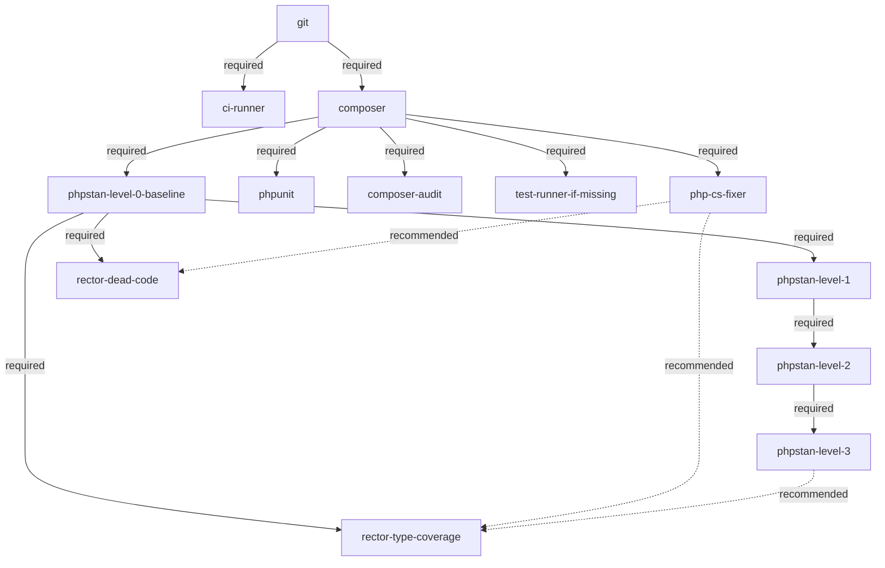

# PHP Tooling Tree

The canonical shape of the PHP specialization's **tooling tree** (ADR-0005, amended by ADR-0007). This document records the form only — nodes and edges. Fulfilment and rejection state lives in each target repo under `docs/refactoring/`. Vocabulary: `CONTEXT.md` (**node**, **required edge**, **recommended edge**).

## Diagram

## Edges

| from (parent) | to (child) | type |
|---|---|---|
| `git` | `composer` | required |
| `git` | `ci-runner` | required |
| `composer` | `php-cs-fixer` | required |
| `composer` | `phpunit` | required |
| `composer` | `test-runner-if-missing` | required |
| `composer` | `composer-audit` | required |
| `composer` | `phpstan-level-0-baseline` | required |
| `phpstan-level-0-baseline` | `phpstan-level-1` | required |
| `phpstan-level-1` | `phpstan-level-2` | required |
| `phpstan-level-2` | `phpstan-level-3` | required |
| `phpstan-level-0-baseline` | `rector-dead-code` | required |
| `phpstan-level-0-baseline` | `rector-type-coverage` | required |
| `php-cs-fixer` | `rector-dead-code` | recommended |
| `php-cs-fixer` | `rector-type-coverage` | recommended |
| `phpstan-level-3` | `rector-type-coverage` | recommended |

The table is the machine-readable source; the diagram is its rendering. Extending the tree means adding a row here and the matching line in the diagram.

## Nodes

A node may span several merge requests; a rejection of a required parent closes every node beneath it, a rejected recommended parent never blocks (the merge request outlook states where it would have helped). Reopening a rejected node is a recorded reversal of its out-of-scope entry; dependents unlock at fulfilment.

### `git`

- **Tool:** git
- **Purpose:** version control — the loop reads history from it and delivers through it.
- **Fulfilment check:** target is a git repository.
- **MR scope:** never an MR — the only hard requirement; without it the suite does not run (ADR-0005).

### `ci-runner`

- **Tool:** GitHub Actions / GitLab CI
- **Purpose:** an existing pipeline that later hosts quality jobs.
- **Fulfilment check:** CI config file present; forge determined from `git remote`; unknown CI → ask, do not record a rejection.
- **MR scope:** pipeline file only. Quality-job children have two parents (this node + their tool) and are deferred to a later wave (ADR-0007).

### `composer`

- **Tool:** Composer
- **Purpose:** dependency management for the Composer-stack track.
- **Fulfilment check:** `composer.json` plus committed lockfile; install runs locally and once CI can run it.
- **MR scope:** composer files and lockfile; no tool adoption inside this MR.

### `php-cs-fixer`

- **Tool:** php-cs-fixer
- **Purpose:** automated code style so later Rector output lands styled.
- **Fulfilment check:** dev dependency installed, config committed, runnable locally with zero reported diffs.
- **MR scope:** dependency + config + one formatting pass.

### `phpunit`

- **Tool:** PHPUnit
- **Purpose:** the project's test runner.
- **Fulfilment check:** dev dependency installed and runnable (`phpunit` exits green on existing tests); an equivalent already present (Pest) fulfils the node.
- **MR scope:** dependency + minimal config; no test rewrites.

### `test-runner-if-missing`

- **Tool:** any test runner
- **Purpose:** guarantees *some* runner exists before deepening work relies on tests.
- **Fulfilment check:** proposed only when no runner exists; fulfilled by adopting one (default PHPUnit).
- **MR scope:** dependency + config + smoke test if none exists.

### `composer-audit`

- **Tool:** composer audit
- **Purpose:** dependency vulnerability visibility (thin node).
- **Fulfilment check:** `composer audit` runs locally without configuration errors.
- **MR scope:** none beyond running it — making it fail CI is a separate child in a later wave (ticket 10).

### `phpstan-level-0-baseline`

- **Tool:** PHPStan
- **Purpose:** static analysis introduced green at level 0.
- **Fulfilment check:** `phpstan/phpstan` as dev dependency, level 0 in `phpstan.neon`, committed baseline file, local run green.
- **MR scope:** dependency + config + baseline generation. Shrinking the baseline belongs to the level nodes' scope.

### `phpstan-level-1`, `phpstan-level-2`, `phpstan-level-3`

- **Tool:** PHPStan
- **Purpose:** raise the analysis level one step at a time.
- **Fulfilment check:** previous level node fulfilled with an **empty baseline**; then bump exactly one level, regenerate the baseline, local run green.
- **MR scope:** level bump + regenerated baseline; shrinking findings into that baseline in the same MR. Unrelated fixes stay out. The chain stays open above level 3 — further levels are appended nodes, not a redesign.

### `rector-dead-code`

- **Tool:** Rector (dead-code suite)
- **Purpose:** remove dead code with rules whose changes are safe to review early.
- **Fulfilment check:** dead-code suite enabled and fully applied — no remaining rule findings.
- **MR scope:** adopted in levels, one MR per level; keeps PHPStan green by shrinking the baseline within the same MRs.

### `rector-type-coverage`

- **Tool:** Rector (typing suites)
- **Purpose:** raise declared type coverage progressively.
- **Fulfilment check:** typing suites enabled and fully applied at the agreed coverage degree.
- **MR scope:** adopted in levels, one MR per level; keeps PHPStan green via baseline shrinking. Proposed once `phpstan-level-0-baseline` is fulfilled; most valuable after `phpstan-level-3` — without strict analysis its rewrites are hard to review, without `php-cs-fixer` its output cannot be styled (stated in the outlook when those are unfulfilled or rejected).
