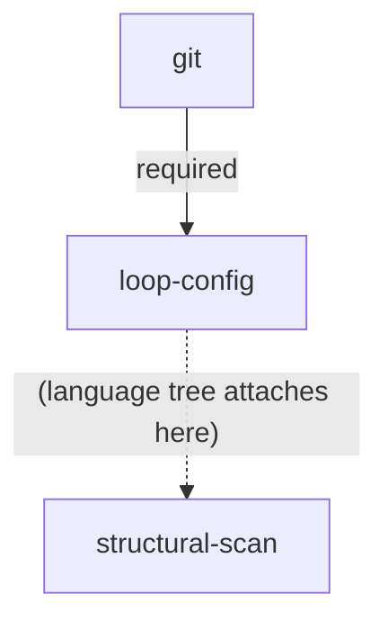

# Tooling Tree

The generic root of every language specialization's **tooling tree** (ADR-0005, amended by ADR-0007 and ADR-0008). Two ordinary prerequisites (`git`, `loop-config`) and one downstream gate (`structural-scan`). Language specializations (PHP: `docs/php-tooling-tree.md`) attach their first-wave nodes beneath `loop-config`, not beneath `git` directly, and declare the edges into `structural-scan` themselves — this document stays language-neutral. Vocabulary: `CONTEXT.md` (**node**, **required edge**, **recommended edge**, **tooling tree**).

## Diagram

The dotted edge above is illustrative only — the real edges into `structural-scan` come from the active language tree's leaf nodes (for PHP: see `docs/php-tooling-tree.md`'s edge table) and use the `resolved` type described under `structural-scan` below, not `required` or `recommended`.

## Edges

| from (parent) | to (child) | type |
|---|---|---|
| `git` | `loop-config` | required |

The table above is the only edge this document owns. A language tree's own edge table is the source for edges into its nodes and into `structural-scan`.

## Nodes

### `git`

- **Tool:** git
- **Purpose:** version control — the loop reads history from it and delivers through it.
- **Fulfilment check:** target is a git repository.
- **MR scope:** never an MR — the only hard requirement; without it the suite does not run (ADR-0005). If missing, `refactor-scan` stops the pass immediately and reports it; nothing is filed.

### `loop-config`

- **Tool:** none — this is the suite's own state, not a third-party tool.
- **Purpose:** the continuous-refactoring loop's own configuration exists in the target repo, so a pass has somewhere to read/write cadence, last-run date, and create-mode.
- **Fulfilment check:** `docs/refactoring/config.md` exists in the target repo.
- **MR scope:** one MR — create `docs/refactoring/config.md` (see `docs/playbooks/refactoring-config.md` for its shape; there is deliberately no stored cadence — the loop never triggers itself). Ordinary node like any other: `refactor-scan` files it as a single `refactor:candidate` issue when missing, same as a PHP tree node, and it is the only candidate filed that pass.

### `structural-scan`

- **Tool:** none — this node represents the loop's own structural-deepening work (the `refactor-scan`/`refactor-design`/`refactor-implement`/`refactor-review` cycle applied to the target's own code), not a third-party tool.
- **Purpose:** hold structural refactoring back until deterministic tooling has had its say — static analysis and a test suite catch regressions that an agent-driven structural change could otherwise introduce silently. Deterministic tools settle first, agent-driven scanning follows (ADR-0008).
- **Fulfilment check:** every leaf node of the active language specialization's tree is **resolved** — fulfilled, or explicitly rejected and recorded under `docs/refactoring/out-of-scope/`. For PHP, the leaf set and the edges into this node are declared in `docs/php-tooling-tree.md`.
- **Edge type — deviation from ADR-0007, read this carefully:** a standard **required edge** closes the child permanently once a parent is rejected (ADR-0007). The edges into `structural-scan` do **not** do that: a rejected leaf still counts as resolved and still unblocks this node once every other leaf also reaches a resolved state. This is deliberate — one declined tooling branch (e.g. Rector rejected as not worth it here) should not permanently forbid ever doing structural work. These edges are labelled `resolved` in a language tree's edge table, never `required` or `recommended`.
- **MR scope:** never an MR by itself — fulfilling this node just opens the gate. Once open, `refactor-scan` proposes it like any other node name (ADR-0010); the actual codebase walk (hot spots, module/interface/depth/seam vocabulary) that turns it into one concrete candidate is `refactor-design`'s job, run only for the node the human actually picked.
