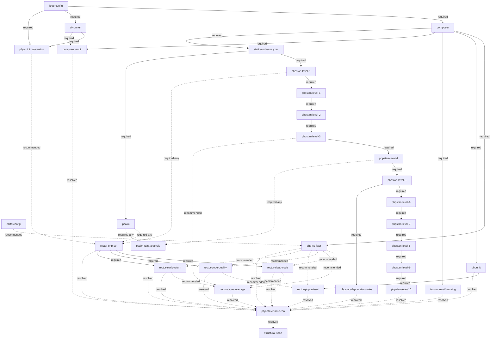

# PHP Tooling Tree

The canonical shape of the PHP specialization's **tooling tree**. This document records the form only — nodes and edges below `loop-config` (see `skills/refactor-scan/references/tooling-tree.md` for the generic root, and for `structural-scan`, this tree's downstream gate). Fulfilment and rejection state lives in each target repo under `docs/refactoring/`. Vocabulary: `CONTEXT.md` (**node**, **required edge**, **required-any edge**, **recommended edge**).

## Diagram



## Edges

| from (parent) | to (child) | type |
|---|---|---|
| `loop-config` | `composer` | required |
| `loop-config` | `ci-runner` | required |
| `loop-config` | `php-minimal-version` | required |
| `ci-runner` | `php-minimal-version` | required |
| `editorconfig` | `php-cs-fixer` | recommended |
| `composer` | `php-cs-fixer` | required |
| `composer` | `phpunit` | required |
| `composer` | `test-runner-if-missing` | required |
| `composer` | `composer-audit` | required |
| `ci-runner` | `composer-audit` | required |
| `composer` | `static-code-analyzer` | required |
| `static-code-analyzer` | `phpstan-level-0` | required |
| `static-code-analyzer` | `psalm` | required |
| `phpstan-level-0` | `phpstan-level-1` | required |
| `phpstan-level-1` | `phpstan-level-2` | required |
| `phpstan-level-2` | `phpstan-level-3` | required |
| `phpstan-level-3` | `phpstan-level-4` | required |
| `phpstan-level-4` | `phpstan-level-5` | required |
| `phpstan-level-5` | `phpstan-level-6` | required |
| `phpstan-level-6` | `phpstan-level-7` | required |
| `phpstan-level-7` | `phpstan-level-8` | required |
| `phpstan-level-8` | `phpstan-level-9` | required |
| `phpstan-level-9` | `phpstan-level-10` | required |
| `phpstan-level-5` | `phpstan-deprecation-rules` | required |
| `phpstan-level-0` | `rector-php-set` | required-any |
| `psalm` | `rector-php-set` | required-any |
| `php-minimal-version` | `rector-php-set` | recommended |
| `rector-php-set` | `rector-dead-code` | required |
| `rector-php-set` | `rector-code-quality` | required |
| `rector-php-set` | `rector-early-return` | required |
| `phpunit` | `rector-phpunit-set` | required |
| `rector-dead-code` | `rector-type-coverage` | recommended |
| `rector-early-return` | `rector-type-coverage` | recommended |
| `rector-code-quality` | `rector-phpunit-set` | recommended |
| `php-cs-fixer` | `rector-dead-code` | recommended |
| `php-cs-fixer` | `rector-type-coverage` | recommended |
| `php-cs-fixer` | `rector-code-quality` | recommended |
| `php-cs-fixer` | `rector-phpunit-set` | recommended |
| `php-cs-fixer` | `rector-early-return` | recommended |
| `phpstan-level-3` | `rector-type-coverage` | recommended |
| `phpstan-level-4` | `psalm-taint-analysis` | required-any |
| `psalm` | `psalm-taint-analysis` | required-any |
| `composer-audit` | `php-structural-scan` | resolved |
| `phpunit` | `php-structural-scan` | resolved |
| `test-runner-if-missing` | `php-structural-scan` | resolved |
| `php-cs-fixer` | `php-structural-scan` | resolved |
| `phpstan-level-10` | `php-structural-scan` | resolved |
| `phpstan-deprecation-rules` | `php-structural-scan` | resolved |
| `rector-dead-code` | `php-structural-scan` | resolved |
| `rector-type-coverage` | `php-structural-scan` | resolved |
| `rector-php-set` | `php-structural-scan` | resolved |
| `rector-code-quality` | `php-structural-scan` | resolved |
| `rector-phpunit-set` | `php-structural-scan` | resolved |
| `rector-early-return` | `php-structural-scan` | resolved |
| `psalm-taint-analysis` | `php-structural-scan` | resolved |
| `php-structural-scan` | `structural-scan` | resolved |

The table is the machine-readable source; the diagram is its rendering. Extending the tree means adding a row here and the matching line in the diagram.

The thirteen `resolved` rows above feed `php-structural-scan`, this tree's own aggregation node — not `structural-scan` directly. `php-structural-scan` is resolved once every one of those thirteen is itself resolved (fulfilled, or rejected under `docs/refactoring/out-of-scope/`), the same `resolved` semantics as `structural-scan`'s own gate (see `skills/refactor-scan/references/tooling-tree.md`'s `structural-scan` node for what `resolved` means and why it exists), just one hop down. `phpstan-level-3` is no longer one of these thirteen — `phpstan-level-10` took over as the level chain's leaf once the chain grew past level 3. A Psalm-only target never fulfils `phpstan-level-10` — see `psalm`'s own node entry below for the mutual-exclusion housekeeping that resolves it as rejected instead; `psalm` itself is deliberately **not** its own leaf here — a dedicated resolved-leaf for it was tried and dropped as redundant ceremony: the `phpstan-level-10` rejection above is sufficient on its own, and giving `psalm` its own leaf only ever added an extra rejection write on the PHPStan path that resolved nothing not already resolved. `psalm-taint-analysis` is the thirteenth leaf — a deterministic security-scan tool exactly like `composer-audit` (also one of these thirteen), so it gates `structural-scan` the same way every other deterministic-tooling leaf here does; not "structural vs. security", but "does this tool produce findings that could collide with agent-driven structural work" (`tooling-tree.md`'s `structural-scan` node states the actual criterion). The final row above, `php-structural-scan → structural-scan`, is this tree's sole direct contribution to `structural-scan`'s own gate — `structural-scan` has one further direct `resolved` parent, `editorconfig`, declared in `tooling-tree.md`'s own edge table instead (both its endpoints are generic-root nodes); see that document's `structural-scan` node for the two-parent picture.

Two edge types beyond `required`/`recommended`/`resolved` appear above: `psalm-taint-analysis`'s two `required-any` rows from `phpstan-level-4`/`psalm`, and `rector-php-set`'s two `required-any` rows from `phpstan-level-0`/`psalm`. Unlike a `required` edge (every parent must be fulfilled), a `required-any` group only needs **at least one** parent fulfilled. `rector-php-set` reading this directly (rather than relying on it being implicit inside `phpstan-level-0`'s own Psalm-equivalence fulfilment check — see the *Equivalents* section below) makes it the gate on which static-analysis path was chosen for `rector-dead-code`/`rector-code-quality`/`rector-early-return`, which no longer carry their own direct edge to `phpstan-level-0` (removed, not replaced) — all three already have `rector-php-set` as a required parent, which now carries the same gate transitively. `rector-type-coverage`/`rector-phpunit-set` are gated by their sibling Rector nodes instead (`recommended` edges — see their own node entries below), not by this gate at all any more. See `rector-php-set`'s and `psalm-taint-analysis`'s own node entries below.

## Nodes

A node may span several merge requests; a rejection of a required parent closes every node beneath it, a rejected recommended parent never blocks (the merge request outlook states where it would have helped). Reopening a rejected node is a recorded reversal of its out-of-scope entry; dependents unlock at fulfilment.

A node's full definition may live in its own file under `php-tooling-tree/` (sibling to this document) once extracted — see `composer` below for the first example. Every node also carries a **Name** — the human-readable label issue titles, merge requests, and chat status use instead of the node's slug (e.g. `phpstan-level-0` → "PHPStan Level 0"). The stub left behind here keeps Name, Tool, and Purpose inline so that label is available without opening the extracted file; Fulfilment check and MR scope move to the extracted file. Nodes not yet extracted stay inline in full.

### PHP floor precheck

The five deterministic PHP tooling leaves (`php-cs-fixer`, `phpunit`, `test-runner-if-missing`, `composer-audit`, `phpstan-level-0`) are each checked once per pass against a known minimum-ever PHP version — the oldest PHP release any published version of that leaf's tool has ever run on — instead of being proposed individually and rejected as `wontfix` once each hits the same underlying PHP-version wall. `tooling_tree.py`'s `_LEAF_MIN_PHP_VERSION` table and `php_floor_precheck()` are the mechanical building blocks; `next_candidates()` and `roadmap()` skip a leaf below its minimum.

**Design decision: skip silently, no `docs/refactoring/out-of-scope/` entry written for a floor-blocked leaf.** The check is cheap and re-derived in full from `composer.json` every pass, so nothing is lost by not persisting it — and that directory otherwise records a genuine human/agent rejection decision (the mechanical-reversal shape below), not a mechanical fact already on disk. Once the target's PHP floor rises, a previously-blocked leaf is simply unblocked next pass; there is nothing to reverse. Consequence worth naming: four of the five leaves above are themselves `structural-scan` leaves (the `resolved` edges above) — while floor-blocked, they count as neither fulfilled nor rejected, so `structural-scan` stays genuinely closed until the floor rises. A human who wants it open anyway can still file the out-of-scope entries by hand; this precheck doesn't do it for them.

### `require-dev` security advisories

A known security advisory in a `require-dev` package never blocks that package's adoption. Dev-only
tooling (test runners, static analysers, style fixers, …) is excluded from production installs
(`composer install --no-dev`) and never ships or runs there — the blast radius stays inside CI/dev
machines. More importantly, the tooling a vulnerable dev-dependency provides — most of all a test suite —
is frequently the prerequisite for the very refactoring/PHP-upgrade path that would let a newer,
non-vulnerable version of that same tool be adopted later; refusing it here would block the fix instead
of enabling it. Applies tree-wide to every `require-dev` node (`phpunit` below is the concrete case that
surfaced this rule). Does not apply to `require` (production) dependencies — that's exactly what
`composer-audit` (below) exists to police.

### `ci-runner`

- **Name:** CI Runner
- **Tool:** GitHub Actions / GitLab CI
- **Purpose:** an existing pipeline that later hosts quality jobs.
- **Fulfilment check:** CI config file present; forge determined from `git remote`; unknown CI → ask, do not record a rejection.
- **MR scope:** pipeline file only. `composer-audit` is a quality-job child with two parents (this node + `composer`). `phpunit` and `phpstan-level-0` do not get their own two-parent children — once this node is fulfilled, each self-wires its own CI gate as part of its own fulfilment check instead.

### `php-minimal-version`

- **Name:** PHP Minimum Version
- **Tool:** none — the tree's own gap detection, not a third-party tool.
- **Purpose:** detect a gap between `composer.json`'s declared PHP floor and what the tree actually needs,
  and propose raising the floor to close it. Motivating case: a target that stayed pinned to an old PHP
  version throughout, solving PHPStan/Rector's own version requirements by running them in a second,
  parallel higher-PHP container instead — nothing in the tree ever raised the floor mismatch itself as a
  candidate.
- **Fulfilment check:** `composer.json`'s declared PHP floor (`_current_php_floor` — `config.platform.php`
  if pinned, else `require.php`'s lower bound) is at least the maximum of: (a) the minimum-ever PHP version
  of any leaf `php_floor_precheck()` currently reports blocked, and (b) the highest PHP version tested by a
  CI job that invokes a quality tool (`vendor/bin/phpstan analyse`, `vendor/bin/psalm`,
  `vendor/bin/rector`, `vendor/bin/php-cs-fixer`) — not an arbitrary compatibility-matrix job that
  legitimately tests multiple PHP versions for unrelated reasons. Floor unknown (no `composer.json`, or
  neither `require.php` nor `config.platform.php` parses) counts as fulfilled — same convention
  `php_floor_precheck()` itself uses: nothing to recommend without a determinable floor.
- **MR scope:** narrow — raise `composer.json`'s `require.php` constraint, plus the CI job that tests the
  app itself if a single unified job exists. Explicitly out of scope: consolidating a separate
  tooling-only container/job into the app's own version, if the target has one — a distinct, later concern
  from the gap this node closes.
- **Re-triggering:** this fulfilment check is a comparison against a moving target, not a one-time artefact
  check — it can flip back to unfulfilled if a later tool raises its minimum, or a new quality-tooling CI
  job tests a higher version, without any special mechanism (every fulfilment check here is already
  re-derived fresh from live repo state each pass). Not retroactive: an already-decided `rector-php-set`
  candidate is unaffected, only still-open proposals are held back again. Elsewhere in this tree's own
  design discussions, a recurring `housekeeping` node (re-proposed on a fixed schedule) is the other,
  time-driven — not fact-driven — case of a fulfilment check that can flip back to false.

### `composer`

- **Name:** Composer
- **Tool:** Composer
- **Purpose:** dependency management for the Composer-stack track.

Full definition (Fulfilment check, MR scope): `skills/refactor-scan/references/php-tooling-tree/composer.md`.

### `php-cs-fixer`

- **Name:** PHP CS Fixer
- **Tool:** php-cs-fixer
- **Purpose:** automated code style so later Rector output lands styled.
- **Fulfilment check:** dev dependency installed, config committed, runnable locally with zero reported diffs.
- **MR scope:** dependency + config + one formatting pass.
- **Recommended parent:** `editorconfig` — settle the target's most basic formatting conventions
  (indentation, charset, line endings) before this node introduces language-specific style rules. This
  node stays withheld from proposal until `editorconfig` is decided (fulfilled or rejected); a rejected
  `editorconfig` still releases this node, it just goes in without that baseline.

### `phpunit`

- **Name:** PHPUnit
- **Tool:** PHPUnit
- **Purpose:** the project's test runner.

Full definition (Fulfilment check, security advisories, MR scope, test-directory layout convention): `skills/refactor-scan/references/php-tooling-tree/phpunit.md`.

### `test-runner-if-missing`

- **Name:** Test Runner (fallback)
- **Tool:** any test runner
- **Purpose:** guarantees *some* runner exists before deepening work relies on tests.
- **Fulfilment check:** proposed only when no runner exists; fulfilled by adopting one (default PHPUnit).
- **MR scope:** dependency + config + smoke test if none exists.

### `composer-audit`

- **Name:** Composer Audit
- **Tool:** composer audit
- **Purpose:** dependency vulnerability visibility, enforced as a CI gate (absorbs what was originally
  tracked as a separate dependency-vulnerability-scan concern, now folded into this node).
- **Fulfilment check:** a CI job exists that runs `composer audit` (the pipeline fails when it reports a
  known advisory).
- **MR scope:** wire `composer audit` into CI as a gate — no production-code change.
- **Stop conditions / when not to propose:** both required parents (`composer`, `ci-runner`) fulfilled is
  necessary but not sufficient — this node also stays blocked until either (a) `composer.json`'s
  `require` block names at least one real package (platform pseudo-packages — `php`, `hhvm`, `ext-*`,
  `lib-*`, `composer-plugin-api`, `composer-runtime-api` — don't count; `composer audit` has nothing to
  check without a real dependency), **or** (b) every other leaf feeding `php-structural-scan` (`phpunit`,
  `test-runner-if-missing`, `php-cs-fixer`, `phpstan-level-10`, `phpstan-deprecation-rules`,
  `rector-dead-code`, `rector-type-coverage`, `rector-php-set`, `rector-code-quality`, `rector-phpunit-set`,
  `rector-early-return`, `psalm-taint-analysis`) is already resolved — so a dependency-free target still eventually resolves this leaf instead of
  leaving `structural-scan` permanently blocked. (a) and (b) are independent alternatives, not ordered.

### `static-code-analyzer`

- **Name:** Static Code Analyzer
- **Tool:** none — pure organizational node, no fulfilment check or MR scope of its own.
- **Purpose:** the shared required parent of the tree's two static-analysis paths, `phpstan-level-0`
  and `psalm` — makes the branch explicit in the diagram/edge table instead of it living only inside
  `phpstan-level-0`'s own fulfilment check, the way it used to.
- **Fulfilment check:** always fulfilled once `composer` (its own required parent) is fulfilled — no
  independent state, no tool run. Adds no additional waiting beyond `composer`'s real fulfilment.
- **MR scope:** none — never proposed, never an MR. Same pattern as `php-structural-scan`: pure plumbing,
  the real work happens in its two children.

### `psalm`

- **Name:** Psalm
- **Tool:** vimeo/psalm
- **Purpose:** an alternative static-analysis path to the PHPStan level chain — recognized when a project
  has already adopted Psalm instead of PHPStan, never suggested as a new adoption (the same fait-accompli
  recognition Pest gets for `phpunit`).
- **Fulfilment check:** `vimeo/psalm` present as a dependency (dev or prod) with a committed
  `psalm.xml`/`psalm.xml.dist`, and `vendor/bin/psalm` exits without errors.
- **MR scope:** none — never proposed as a candidate by `next_candidates()`/`roadmap()`; recognized only
  when already present. Adopting Psalm from scratch is a decision made outside this tree's proposal flow,
  same as choosing Pest over PHPUnit.
- **Mutual exclusion:** the first scan pass that recognizes this node fulfilled while real
  PHPStan adoption is absent should write
  `docs/refactoring/out-of-scope/phpstan-level-10.md` if it isn't already present — this resolves
  `phpstan-level-10` (the PHPStan level chain's `php-structural-scan` leaf) as rejected instead of leaving
  it permanently neither-fulfilled-nor-rejected. Because this node has no tree-proposed MR of its own to
  attach the write to (`MR scope: none`, above), this is housekeeping the scanning agent performs as part
  of that recognition pass, not part of an MR — the same "an agent records a decision" shape the
  `out-of-scope/` convention already requires (see *Nodes* preamble above), just triggered by recognition
  instead of an MR landing. Template (mirrors the shape already used throughout
  `docs/refactoring/out-of-scope/` in this repo's own fixtures):
  ```markdown
  # Rejection: PHPStan Level 10

  **Date:** <today>
  **Reason:** mutual exclusion — this target adopted Psalm as its static analyzer (`psalm` node
  fulfilled); the PHPStan level chain does not apply (see `phpstan` equivalents below).
  **Scope:** subtree phpstan
  ```
  This does **not** touch `phpstan-level-0` itself — see that node's own entry and the
  *Equivalents* section below for why its equivalence-driven fulfilment must stay intact.
- **Co-presence:** if both PHPStan and Psalm are present, PHPStan is authoritative for the level chain (see
  *Equivalents* below) — this node still shows fulfilled, harmlessly; nothing downstream reads its
  fulfilled state except `phpstan-level-0`'s own equivalence bullet and `rector-php-set`'s
  `required-any` gate (already satisfied via `phpstan-level-0` on that path regardless, so this is
  never load-bearing there either). A target that adopts `psalm-taint-analysis` (below) on the PHPStan path
  also installs `vimeo/psalm` and a `psalm.xml`, which makes this node's own fulfilment check incidentally
  read `true` too — harmless: `psalm` isn't a `php-structural-scan` leaf, so there's no
  resolved-leaf state this could disturb. See `psalm-taint-analysis`'s own entry for the full reasoning.

### `phpstan-level-0`

- **Name:** PHPStan Level 0
- **Tool:** PHPStan (`vimeo/psalm`, via the `psalm` node above, fulfils as an equivalent — see the extracted file's *Equivalents* section).
- **Purpose:** static analysis introduced green at level 0.

### `phpstan-level-1` through `phpstan-level-10`

- **Names:** `phpstan-level-N` → "PHPStan Level N" for each `N` in 1–10 (e.g. `phpstan-level-4` → "PHPStan Level 4").
- **Tool:** PHPStan
- **Purpose:** raise the analysis level one step at a time, straight through the chain, same rules
  throughout, no redesign at any level — `phpstan-level-10` is the chain's resolved-leaf into
  `php-structural-scan` (see that node's own entry); `phpstan-level-1`–`-9` are ordinary intermediate
  nodes.

### `phpstan-deprecation-rules`

- **Name:** PHPStan Deprecation Rules
- **Tool:** PHPStan (deprecation rule set — bundled rules PHPStan reports independently of `level`)
- **Purpose:** flag calls to deprecated APIs/functions, orthogonal to the level chain's strictness ladder —
  adopted once the codebase is far enough along the chain that deprecation noise isn't drowned out by
  lower-level findings.
- **Required parent:** `phpstan-level-5` — proposed once the chain has reached level 5, a threshold decided
  directly with the user rather than tied to level 10's top.

Full definition for all three above (Fulfilment check, Config, MR scope, Stop conditions, Verification) and
the cross-cutting *`phpstan` equivalents* section (Psalm's equivalence to `phpstan-level-0`, why the level
chain doesn't apply under Psalm, co-presence, and how mutual exclusion interacts with this equivalence):
`skills/refactor-scan/references/php-tooling-tree/phpstan.md`.

### `psalm-taint-analysis`

- **Name:** Psalm Taint Analysis
- **Tool:** vimeo/psalm (`--taint-analysis`)
- **Purpose:** security-focused taint analysis (SQL injection, XSS, and similar tainted-data-flow bugs) —
  a distinct capability from Psalm's general static analysis, orthogonal to which general analyzer a
  target chose. Available once either general-analysis path has matured enough to be worth layering a
  security scan on top of, regardless of whether that path is PHPStan or Psalm.
- **Required-any parents:** `phpstan-level-4`, `psalm` — a new edge type (`CONTEXT.md`: **required-any
  edge**) distinct from a `required` edge: this node is proposed once **at least one** of these is
  fulfilled, not both. Either a target that reached PHPStan level 4, or a target that chose Psalm as its
  general analyzer, unlocks this node.
- **Fulfilment check:** `vimeo/psalm` present as a dependency (dev or prod), a committed
  `psalm.xml`/`psalm.xml.dist`, and — once `ci-runner` is fulfilled — a CI job that actually invokes
  `vendor/bin/psalm --taint-analysis` (self-wired CI gate, same ticket-34 shape as
  `phpstan-level-0`'s own CI check; no CI yet still fulfils the node on local adoption alone).
- **MR scope:** on the Psalm path, `vimeo/psalm` and `psalm.xml` already exist (via the `psalm` node) —
  this MR only wires the `--taint-analysis` CI invocation. On the PHPStan path, this MR additionally runs
  `composer require --dev vimeo/psalm` and commits a `psalm.xml` (reused for taint-checking only, not as a
  competing general analyzer) alongside the CI wiring.
- **Co-presence caveat:** adopting this node on the PHPStan path installs `vimeo/psalm` + `psalm.xml`
  purely for taint scanning, which incidentally makes the `psalm` node's own live-detected `fulfilled` flag
  read `true` too. This is harmless: `psalm` isn't a `php-structural-scan` leaf (see that node's entry
  above), so there's no resolved-leaf state to disturb; `rector-php-set`'s
  `required-any(phpstan-level-0, psalm)` gate stays satisfied regardless either way on the PHPStan
  path (already unlocked via `phpstan-level-0`); and the PHPStan/Psalm choice itself was never
  encoded as a written rejection to begin with (see `phpstan-level-0`'s own MR-scope entry) — only
  the tree structure and each node's own detection record it. Nothing reads `psalm.fulfilled` in a way this
  incidental flip could break.
- **`php-structural-scan` resolved-leaf:** yes — one of the thirteen. The gate's purpose is "deterministic
  tooling has had its say before agent-driven structural work begins" (`tooling-tree.md`'s `structural-scan`
  node), not "structural-quality tools only" — `composer-audit` is already one of these thirteen leaves and
  is itself a pure security scan (dependency vulnerabilities), so excluding this node on a "security vs.
  structural" distinction wouldn't have been consistent with that precedent.

### `rector-dead-code`

- **Name:** Rector: Dead Code Set
- **Tool:** Rector (dead-code suite)
- **Purpose:** remove dead code with rules whose changes are safe to review early.
- **Fulfilment check:** dead-code suite enabled and fully applied — no remaining rule findings.
- **MR scope:** adopted in levels, one MR per level; keeps PHPStan green by shrinking the baseline within the same MRs. Proposed once `rector-php-set` is fulfilled **and** `php-cs-fixer` has been decided (fulfilled or rejected) — a still-undecided `php-cs-fixer` withholds this node so its dead-code rewrites don't land unstyled; a rejected `php-cs-fixer` still releases it, it just never gets styled output. Does not carry its own direct required parent on `phpstan-level-0` — `rector-php-set`'s own `required-any` gate (see that node's entry below) already covers which static-analysis path was chosen; duplicating it here would be redundant.

### `rector-type-coverage`

- **Name:** Rector: Type Coverage Set
- **Tool:** Rector (typing suites)
- **Purpose:** raise declared type coverage progressively.
- **Fulfilment check:** typing suites enabled and fully applied at the agreed coverage degree.
- **MR scope:** adopted in levels, one MR per level; keeps PHPStan green via baseline shrinking. Proposed once `rector-dead-code` **and** `rector-early-return` have both been decided **and** both `php-cs-fixer` and `phpstan-level-3` have been decided (fulfilled or rejected) — without strict analysis its rewrites are hard to review, without `php-cs-fixer` its output cannot be styled, without dead code removed or control flow flattened first its type-coverage rewrites touch messier code, so this node waits on all three pairs. Any one being rejected instead of fulfilled still releases this node, it just goes in without that particular benefit. The `phpstan-level-3` threshold stays put here even though the level chain itself now reaches `phpstan-level-10` — level 3 was already judged "strict enough" for reviewable Rector rewrites.
- **No required parent** (as of the `rector-dead-code`/`rector-early-return` restructuring above) — unlike
  every other node in this family, nothing here directly or transitively requires `rector-php-set` (or,
  through it, that a static analyzer was chosen) to be *fulfilled*; only decided recommended parents gate
  it, and a rejected recommended parent still releases its child same as any other recommended edge in
  this tree (*Nodes* preamble above). In
  principle this node could become proposable with `rector-dead-code`/`rector-early-return` both rejected
  and `rector-php-set` never touched at all — an edge case, not a new category of gap (nothing in this tree
  validates that a rejected node was ever reachable first), but worth naming plainly rather than implying a
  guarantee that no longer holds.

### `rector-php-set`

- **Name:** Rector: PHP Set
- **Tool:** Rector (versioned PHP-upgrade rule set, e.g. `LevelSetList::up_to_php_8x`)
- **Purpose:** adopt Rector's own PHP-version-targeted rule set — the common gate the other Rector
  rule-set nodes below wait on, mirroring how `phpstan-level-0`/`psalm` gate the family today.
- **Fulfilment check:** the PHP-version rule set enabled in `rector.php`/`rector.neon` and fully applied —
  no remaining rule findings.
- **MR scope:** adopted in levels, one MR per target PHP version bump; keeps PHPStan green by shrinking
  the baseline within the same MRs (same shape as `rector-dead-code`).
- **Required-any parents:** `phpstan-level-0`, `psalm` — either fulfilled
  unlocks this node. Previously this was a single `required` parent on `phpstan-level-0` alone
  (relying on that node's own Psalm-equivalence branch to also cover the Psalm path implicitly); reading
  the `required-any` group directly instead makes the OR explicit at the edge level and is now the gate on
  which static-analysis path was chosen for this node's own three direct children —
  `rector-dead-code`/`rector-code-quality`/`rector-early-return` (see those nodes' own **Required parent**
  lines) — read it transitively via their required parent on this node. `rector-type-coverage`/
  `rector-phpunit-set` are *not* among them any more (a later restructuring made them wait on sibling Rector
  nodes instead — see those nodes' own entries for why they no longer transitively depend on this gate at
  all). No `php-cs-fixer` recommended parent (unlike the sibling Rector nodes below) — decided directly with
  the user; this node is the styling-order exception in the family.
- **Recommended parent:** `php-minimal-version` — this node's rule set rewrites code to target syntax for a
  PHP version composer.json may not even declare support for yet; closes the one gap where this family
  previously had no dependency on the runtime floor at all.

### `rector-code-quality`

- **Name:** Rector: Code Quality Set
- **Tool:** Rector (code-quality suite)
- **Purpose:** apply Rector's code-quality rewrites (readability/idiom improvements beyond dead-code removal).
- **Fulfilment check:** code-quality suite enabled and fully applied — no remaining rule findings.
- **MR scope:** adopted in levels, one MR per level; keeps PHPStan green by shrinking the baseline within
  the same MRs.
- **Required parent:** `rector-php-set`.
- **Recommended parent:** `php-cs-fixer` — settle styling before these rewrites land, same rationale/
  mechanics as `rector-dead-code`'s own `php-cs-fixer` recommended parent.

### `rector-phpunit-set`

- **Name:** Rector: PHPUnit Set
- **Tool:** Rector (PHPUnit-specific rule set)
- **Purpose:** modernize PHPUnit test code (assertion methods, annotations → attributes, etc.) via Rector's
  PHPUnit rule set.
- **Fulfilment check:** PHPUnit suite enabled and fully applied — no remaining rule findings.
- **MR scope:** adopted in levels, one MR per level.
- **Required parent:** `phpunit` — this node rewrites PHPUnit-specific code, so it needs PHPUnit (or its
  fait-accompli equivalent, Pest, which the `phpunit` node already recognizes) actually adopted first. No
  longer requires `rector-php-set` directly either (a later restructuring moved that gate to
  `rector-code-quality`'s recommended parent below) — same "no required tie to the static-analyzer choice
  any more" situation as `rector-type-coverage`, see that node's entry for the caveat.
- **Recommended parents:** `rector-code-quality`, `php-cs-fixer` — settle code-quality rewrites first, same
  non-blocking ordering rationale as `rector-type-coverage`'s new recommended parents above.

### `rector-early-return`

- **Name:** Rector: Early Return Set
- **Tool:** Rector (early-return suite)
- **Purpose:** flatten nested conditionals into early returns via Rector's early-return rule set.
- **Fulfilment check:** early-return suite enabled and fully applied — no remaining rule findings.
- **MR scope:** adopted in levels, one MR per level.
- **Required parent:** `rector-php-set`.
- **Recommended parent:** `php-cs-fixer`.

### `php-structural-scan`

- **Name:** PHP Structural Scan (internal — never proposed; see below)
- **Tool:** none — pure aggregation node, no fulfilment check or MR scope of its own.
- **Purpose:** the PHP tree's own contribution to `structural-scan`'s gate (`skills/refactor-scan/references/tooling-tree.md`), collapsed into one `resolved` edge instead of thirteen direct ones — see that document's `structural-scan` node for why (scales to a future second language specialization contributing its own aggregation node the same way).
- **Fulfilment check:** every one of its thirteen `resolved` parents above (`composer-audit`, `phpunit`, `test-runner-if-missing`, `php-cs-fixer`, `phpstan-level-10`, `phpstan-deprecation-rules`, `rector-dead-code`, `rector-type-coverage`, `rector-php-set`, `rector-code-quality`, `rector-phpunit-set`, `rector-early-return`, `psalm-taint-analysis`) is itself resolved — fulfilled, or rejected under `docs/refactoring/out-of-scope/`. Identical `resolved`-edge semantics to `structural-scan`'s own gate, one hop down: a rejected leaf here still counts as resolved. `psalm` is deliberately **not** one of these — see its own node entry above for why a dedicated leaf for it turned out to be redundant; the `phpstan-level-10` leaf's own mutual-exclusion rejection (housekeeping on `psalm`'s own node entry) is what actually resolves the PHPStan/Psalm choice for this gate.
- **MR scope:** none — never proposed, never an MR. There is no real-world action to take *as* `php-structural-scan`; the thirteen leaves above are where the real work happens. `refactor-scan`/`next_candidates()`/`roadmap()` must never surface this node as a candidate — it exists only so `structural-scan`'s own gate can read one edge instead of thirteen.
