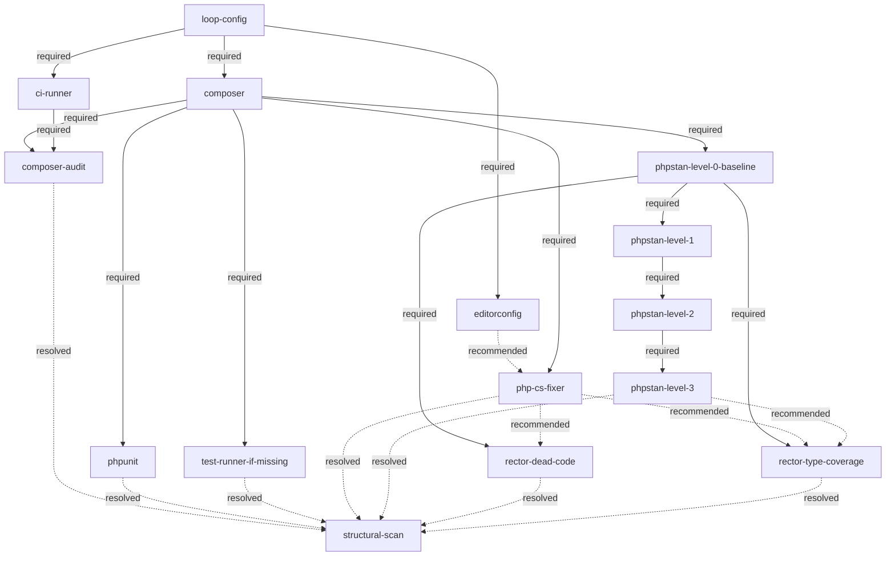

# PHP Tooling Tree

The canonical shape of the PHP specialization's **tooling tree**. This document records the form only — nodes and edges below `loop-config` (see `skills/refactor-scan/references/tooling-tree.md` for the generic root, and for `structural-scan`, this tree's downstream gate). Fulfilment and rejection state lives in each target repo under `docs/refactoring/`. Vocabulary: `CONTEXT.md` (**node**, **required edge**, **recommended edge**).

## Diagram



## Edges

| from (parent) | to (child) | type |
|---|---|---|
| `loop-config` | `composer` | required |
| `loop-config` | `ci-runner` | required |
| `loop-config` | `editorconfig` | required |
| `editorconfig` | `php-cs-fixer` | recommended |
| `composer` | `php-cs-fixer` | required |
| `composer` | `phpunit` | required |
| `composer` | `test-runner-if-missing` | required |
| `composer` | `composer-audit` | required |
| `ci-runner` | `composer-audit` | required |
| `composer` | `phpstan-level-0-baseline` | required |
| `phpstan-level-0-baseline` | `phpstan-level-1` | required |
| `phpstan-level-1` | `phpstan-level-2` | required |
| `phpstan-level-2` | `phpstan-level-3` | required |
| `phpstan-level-0-baseline` | `rector-dead-code` | required |
| `phpstan-level-0-baseline` | `rector-type-coverage` | required |
| `php-cs-fixer` | `rector-dead-code` | recommended |
| `php-cs-fixer` | `rector-type-coverage` | recommended |
| `phpstan-level-3` | `rector-type-coverage` | recommended |
| `composer-audit` | `structural-scan` | resolved |
| `phpunit` | `structural-scan` | resolved |
| `test-runner-if-missing` | `structural-scan` | resolved |
| `php-cs-fixer` | `structural-scan` | resolved |
| `phpstan-level-3` | `structural-scan` | resolved |
| `rector-dead-code` | `structural-scan` | resolved |
| `rector-type-coverage` | `structural-scan` | resolved |

The table is the machine-readable source; the diagram is its rendering. Extending the tree means adding a row here and the matching line in the diagram.

The seven `resolved` rows above are not `required` or `recommended` — see `skills/refactor-scan/references/tooling-tree.md`'s `structural-scan` node for what `resolved` means (a rejected leaf still unblocks `structural-scan`, unlike a rejected required parent) and why it exists.

## Nodes

A node may span several merge requests; a rejection of a required parent closes every node beneath it, a rejected recommended parent never blocks (the merge request outlook states where it would have helped). Reopening a rejected node is a recorded reversal of its out-of-scope entry; dependents unlock at fulfilment.

A node's full definition may live in its own file under `php-tooling-tree/` (sibling to this document) once extracted — see `composer` below for the first example. Every node also carries a **Name** — the human-readable label issue titles, merge requests, and chat status use instead of the node's slug (e.g. `phpstan-level-0-baseline` → "PHPStan Level 0"). The stub left behind here keeps Name, Tool, and Purpose inline so that label is available without opening the extracted file; Fulfilment check and MR scope move to the extracted file. Nodes not yet extracted stay inline in full.

### PHP floor precheck (ticket 31)

The five deterministic PHP tooling leaves (`php-cs-fixer`, `phpunit`, `test-runner-if-missing`, `composer-audit`, `phpstan-level-0-baseline`) are each checked once per pass against a known minimum-ever PHP version — the oldest PHP release any published version of that leaf's tool has ever run on — instead of being proposed individually and rejected as `wontfix` once each hits the same underlying PHP-version wall. `tooling_tree.py`'s `_LEAF_MIN_PHP_VERSION` table and `php_floor_precheck()` are the mechanical building blocks; `next_candidates()` and `roadmap()` skip a leaf below its minimum.

**Design decision: skip silently, no `docs/refactoring/out-of-scope/` entry written for a floor-blocked leaf.** The check is cheap and re-derived in full from `composer.json` every pass, so nothing is lost by not persisting it — and that directory otherwise records a genuine human/agent rejection decision (the mechanical-reversal shape below), not a mechanical fact already on disk. Once the target's PHP floor rises, a previously-blocked leaf is simply unblocked next pass; there is nothing to reverse. Consequence worth naming: four of the five leaves above are themselves `structural-scan` leaves (the `resolved` edges above) — while floor-blocked, they count as neither fulfilled nor rejected, so `structural-scan` stays genuinely closed until the floor rises. A human who wants it open anyway can still file the out-of-scope entries by hand; this precheck doesn't do it for them.

### `require-dev` security advisories

A known security advisory in a `require-dev` package never blocks that package's adoption. Dev-only
tooling (test runners, static analysers, style fixers, …) is excluded from production installs
(`composer install --no-dev`) and never ships or runs there — the blast radius stays inside CI/dev
machines. More importantly, the tooling a vulnerable dev-dependency provides — most of all a test suite —
is frequently the prerequisite for the very refactoring/PHP-upgrade path that would let a newer,
non-vulnerable version of that same tool be adopted later; refusing it here would block the fix instead
of enabling it. Applies tree-wide to every `require-dev` node (`phpunit` below is the concrete case that
surfaced this rule). Does not apply to `require` (production) dependencies — that's exactly what
`composer-audit` (below) exists to police.

### `ci-runner`

- **Name:** CI Runner
- **Tool:** GitHub Actions / GitLab CI
- **Purpose:** an existing pipeline that later hosts quality jobs.
- **Fulfilment check:** CI config file present; forge determined from `git remote`; unknown CI → ask, do not record a rejection.
- **MR scope:** pipeline file only. `composer-audit` is a quality-job child with two parents (this node + `composer`). `phpunit` and `phpstan-level-0-baseline` do not get their own two-parent children — once this node is fulfilled, each self-wires its own CI gate as part of its own fulfilment check instead (ticket 34).

### `composer`

- **Name:** Composer
- **Tool:** Composer
- **Purpose:** dependency management for the Composer-stack track.

Full definition (Fulfilment check, MR scope): `skills/refactor-scan/references/php-tooling-tree/composer.md`.

### `php-cs-fixer`

- **Name:** PHP CS Fixer
- **Tool:** php-cs-fixer
- **Purpose:** automated code style so later Rector output lands styled.
- **Fulfilment check:** dev dependency installed, config committed, runnable locally with zero reported diffs.
- **MR scope:** dependency + config + one formatting pass.
- **Recommended parent:** `editorconfig` — settle the target's most basic formatting conventions
  (indentation, charset, line endings) before this node introduces language-specific style rules. This
  node stays withheld from proposal until `editorconfig` is decided (fulfilled or rejected); a rejected
  `editorconfig` still releases this node, it just goes in without that baseline.

### `phpunit`

- **Name:** PHPUnit
- **Tool:** PHPUnit
- **Purpose:** the project's test runner.

Full definition (Fulfilment check, security advisories, MR scope, test-directory layout convention): `skills/refactor-scan/references/php-tooling-tree/phpunit.md`.

### `test-runner-if-missing`

- **Name:** Test Runner (fallback)
- **Tool:** any test runner
- **Purpose:** guarantees *some* runner exists before deepening work relies on tests.
- **Fulfilment check:** proposed only when no runner exists; fulfilled by adopting one (default PHPUnit).
- **MR scope:** dependency + config + smoke test if none exists.

### `composer-audit`

- **Name:** Composer Audit
- **Tool:** composer audit
- **Purpose:** dependency vulnerability visibility, enforced as a CI gate (absorbs what was originally
  tracked as a separate dependency-vulnerability-scan concern, now folded into this node).
- **Fulfilment check:** a CI job exists that runs `composer audit` (the pipeline fails when it reports a
  known advisory).
- **MR scope:** wire `composer audit` into CI as a gate — no production-code change.
- **Stop conditions / when not to propose:** both required parents (`composer`, `ci-runner`) fulfilled is
  necessary but not sufficient — this node also stays blocked until either (a) `composer.json`'s
  `require` block names at least one real package (platform pseudo-packages — `php`, `hhvm`, `ext-*`,
  `lib-*`, `composer-plugin-api`, `composer-runtime-api` — don't count; `composer audit` has nothing to
  check without a real dependency), **or** (b) every other leaf feeding `structural-scan` (`phpunit`,
  `test-runner-if-missing`, `php-cs-fixer`, `phpstan-level-3`, `rector-dead-code`, `rector-type-coverage`)
  is already resolved — so a dependency-free target still eventually resolves this leaf instead of
  leaving `structural-scan` permanently blocked. (a) and (b) are independent alternatives, not ordered.

### `phpstan-level-0-baseline`

- **Name:** PHPStan Level 0
- **Tool:** PHPStan (`vimeo/psalm` fulfils as an equivalent — see *Equivalents* below).
- **Purpose:** static analysis introduced green at level 0.
- **Fulfilment check:** one of:
  - **PHPStan path (canonical):** `phpstan/phpstan` present as a dev dependency, `phpstan.neon` at the repo root declares `level: 0`, a committed baseline file exists at the fixed path `phpstan-baseline.neon` (repo root), `vendor/bin/phpstan analyse` (with the baseline included) exits 0 without errors, **and**, once `ci-runner` is fulfilled, a CI job actually invokes `vendor/bin/phpstan analyse` (self-wired CI gate, ticket 34 — no CI yet still fulfils the node on local adoption alone; see `ci-runner`'s node prose). The CI check is level-independent, so it lives here and is not repeated on `phpstan-level-1..3`. OR
  - **Psalm path (equivalent):** `vimeo/psalm` present (dev or prod dependency) with a committed `psalm.xml` / `psalm.xml.dist` and `vendor/bin/psalm` exits without errors — then this node is considered fulfilled without PHPStan. Psalm's own strictness is tracked via its `errorLevel`, not via the PHPStan level chain. No CI-gating requirement on this path yet — a follow-up ticket giving Psalm its own node is the intended place to add one.
- **Config (PHPStan path):**
  - `phpstan.neon` — committed at repo root (not `phpstan.neon.dist`). Minimal exact content:
    ```neon
    parameters:
        level: 0
        paths:
            - src
        excludePaths:
            - vendor
    includes:
        - phpstan-baseline.neon
    ```
    `paths` is resolved from `composer.json` `autoload` / `autoload-dev` (`psr-4` + `psr-0` directories; `files` ignored). If no autoload directories are declared, the fallback is `src`. Additional source roots (e.g., `tests/` when not already covered) may be appended when present. `excludePaths` always contains `vendor`. `includes` references the baseline at the fixed path `phpstan-baseline.neon` (repo root); the line is present in `phpstan.neon` from the introduce MR onward.
  - `phpstan-baseline.neon` — committed at repo root. Auto-generated, never hand-edited. Generated by `vendor/bin/phpstan analyse --generate-baseline=phpstan-baseline.neon` (overwrites if present). Contains `parameters.ignoreErrors` entries for all violations at the current level; when no violations remain the file is still committed but contains an empty ignore list (see *Empty baseline*).
  - Dependency versioning follows the target's pinning policy; if none is declared, use a `^` caret range with a committed `composer.lock`.
- **MR scope:** dependency addition (`composer require --dev phpstan/phpstan`) + `phpstan.neon` with `level: 0` + initial baseline generation (`--generate-baseline`) committed together, leaving `vendor/bin/phpstan analyse` green (exit 0). Shrinking the baseline belongs to the level nodes' scope, not this introduce MR. No level above 0 and no additional rulesets are introduced here. If `ci-runner` is already fulfilled when this MR lands, it also wires `vendor/bin/phpstan analyse` into CI as a gate (ticket 34) — mirrors `phpunit`'s own MR-scope line.
- **Verification:** `composer install` succeeds locally; `vendor/bin/phpstan analyse --error-format=table` (or plain `vendor/bin/phpstan analyse`) exits 0 with the committed baseline included.

### `phpstan-level-1`, `phpstan-level-2`, `phpstan-level-3`

- **Names:** `phpstan-level-1` → PHPStan Level 1, `phpstan-level-2` → PHPStan Level 2, `phpstan-level-3` → PHPStan Level 3
- **Tool:** PHPStan
- **Purpose:** raise the analysis level one step at a time.
- **Fulfilment check:** the immediate predecessor level node is fulfilled **and** its baseline is **empty** (see *Empty baseline*). Then: bump `level` in `phpstan.neon` by exactly one (e.g., `0 → 1`, `1 → 2`), regenerate `phpstan-baseline.neon` via `vendor/bin/phpstan analyse --generate-baseline=phpstan-baseline.neon`, and `vendor/bin/phpstan analyse` is green. Levels are never skipped; one MR raises exactly one level.
- **Empty baseline — operational definition:** `phpstan-baseline.neon` is **absent** at repo root **OR** the file exists but `parameters.ignoreErrors` is absent or an empty array (no `message:` entries). Both count as empty. A file that exists and contains one or more ignore entries is non-empty and blocks the next level raise. The scan performs this check by parsing the Neon file (or, equivalently, counting `message:` entries); an absent file is treated as zero entries. After the introduce MR the file is normally present; absence is tolerated as empty for the purpose of gating the next level, but after any successful analysis the committed state should include the file (empty list when green without baseline).
- **MR scope:** level bump (single integer increment) + regenerated baseline (overwritten in place) + only those source fixes that strictly reduce the new baseline's `ignoreErrors` count. Shrinking findings into the regenerated baseline is part of the same MR — the MR must commit the reduced baseline alongside any fixes that produced the reduction. Unrelated refactoring or feature changes stay out. The chain stays open above level 3 — further levels (`phpstan-level-4`, etc.) are appended as new nodes with the same rules, not a redesign.
- **Stop conditions / when not to raise:**
  - Baseline is non-empty → do not propose the next level; the loop proposes shrinking work (candidates flagged by the fulfilled tooling, or Rector steps that reduce baseline entries) until the baseline becomes empty.
  - Immediate predecessor level node is not fulfilled → blocked by the required edge; the scan does not propose out-of-order levels.
  - Target uses Psalm as its `phpstan-level-0-baseline` fulfiller → level nodes are not proposed at all (see *Equivalents*). Psalm strictness is governed by `psalm.xml` `errorLevel`, not by this chain.
  - CI is irrelevant to this node's gating: the fulfilment check is local (`vendor/bin/phpstan analyse` green). The CI-job child with two parents (tool + `ci-runner`) remains deferred and does not gate the level chain.
- **Verification:** after the MR, `vendor/bin/phpstan analyse` exits 0 at the new level with the committed baseline; `phpstan.neon` diff is exactly one `level:` line change; `phpstan-baseline.neon` is regenerated and reflects the current violations at that level.

### `phpstan` equivalents

- **Psalm (`vimeo/psalm`) fulfils `phpstan-level-0-baseline`** — fill gaps, never downgrade; an equivalent fulfils the node (same as Pest fulfils `phpunit`). Detection: `composer.json` lists `vimeo/psalm` and a Psalm config file (`psalm.xml` or `psalm.xml.dist`) exists. When present and green, the scan marks `phpstan-level-0-baseline` as fulfilled and does not propose the PHPStan introduce candidate.
- **Level nodes (`phpstan-level-1` → `phpstan-level-3`) do not apply when Psalm is the fulfiller.** They are PHPStan-specific. A project that chose Psalm raises strictness via Psalm's `errorLevel` (8 loosest → 1 strictest) rather than via PHPStan levels; proposing a PHPStan level on top of a Psalm-only codebase would reintroduce a second analyser as a new, out-of-scope decision. If a repo later replaces Psalm with PHPStan, that is recorded as a reversal of the Psalm equivalent and the PHPStan introduce + level chain is then proposed from level 0.
- **Co-presence:** if both analysers are present, PHPStan is the authoritative check for this tree; Psalm fulfilment is considered superseded and the standard PHPStan baseline/level rules apply.
- **No other analyser fulfils the node:** only `vimeo/psalm` is recognised as an equivalent for the PHPStan nodes. Other tools (e.g., Phan, Psalm plugins) are not treated as fulfilling this chain.

### `rector-dead-code`

- **Name:** Rector: Dead Code Set
- **Tool:** Rector (dead-code suite)
- **Purpose:** remove dead code with rules whose changes are safe to review early.
- **Fulfilment check:** dead-code suite enabled and fully applied — no remaining rule findings.
- **MR scope:** adopted in levels, one MR per level; keeps PHPStan green by shrinking the baseline within the same MRs. Proposed once `phpstan-level-0-baseline` is fulfilled **and** `php-cs-fixer` has been decided (fulfilled or rejected) — a still-undecided `php-cs-fixer` withholds this node so its dead-code rewrites don't land unstyled; a rejected `php-cs-fixer` still releases it, it just never gets styled output.

### `rector-type-coverage`

- **Name:** Rector: Type Coverage Set
- **Tool:** Rector (typing suites)
- **Purpose:** raise declared type coverage progressively.
- **Fulfilment check:** typing suites enabled and fully applied at the agreed coverage degree.
- **MR scope:** adopted in levels, one MR per level; keeps PHPStan green via baseline shrinking. Proposed once `phpstan-level-0-baseline` is fulfilled **and** both `php-cs-fixer` and `phpstan-level-3` have been decided (fulfilled or rejected) — without strict analysis its rewrites are hard to review, without `php-cs-fixer` its output cannot be styled, so this node waits on both. Either one being rejected instead of fulfilled still releases this node, it just goes in without that particular benefit.
