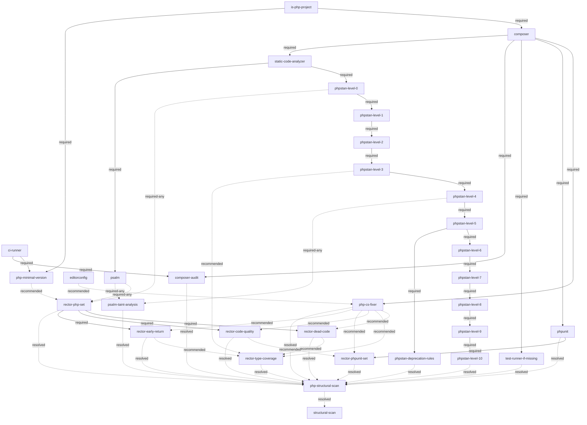

# PHP Tooling Tree

The canonical shape of the PHP specialization's **tooling tree**. This document records the form only — nodes and edges below this specialization's own **recognition gate**, `is-php-project` (see `skills/refactor-scan/references/tooling-tree.md` for the generic root — `is-php-project`'s own definition, `loop-config`, `structural-scan`, and `ci-runner`, referenced below purely for the PHP-specific edges hanging off it). Fulfilment and rejection state lives in each target repo's Refactoring Notes (`skills/continuous-refactoring/references/refactoring-bookkeeping.md`). Vocabulary: `CONTEXT.md` (**node**, **required edge**, **required-any edge**, **recommended edge**).

## Diagram

## Edges

| from (parent) | to (child) | type |
|---|---|---|
| `is-php-project` | `composer` | required |
| `is-php-project` | `php-minimal-version` | required |
| `ci-runner` | `php-minimal-version` | required |
| `editorconfig` | `php-cs-fixer` | recommended |
| `composer` | `php-cs-fixer` | required |
| `composer` | `phpunit` | required |
| `composer` | `test-runner-if-missing` | required |
| `composer` | `composer-audit` | required |
| `ci-runner` | `composer-audit` | required |
| `composer` | `static-code-analyzer` | required |
| `static-code-analyzer` | `phpstan-level-0` | required |
| `static-code-analyzer` | `psalm` | required |
| `phpstan-level-0` | `phpstan-level-1` | required |
| `phpstan-level-1` | `phpstan-level-2` | required |
| `phpstan-level-2` | `phpstan-level-3` | required |
| `phpstan-level-3` | `phpstan-level-4` | required |
| `phpstan-level-4` | `phpstan-level-5` | required |
| `phpstan-level-5` | `phpstan-level-6` | required |
| `phpstan-level-6` | `phpstan-level-7` | required |
| `phpstan-level-7` | `phpstan-level-8` | required |
| `phpstan-level-8` | `phpstan-level-9` | required |
| `phpstan-level-9` | `phpstan-level-10` | required |
| `phpstan-level-5` | `phpstan-deprecation-rules` | required |
| `phpstan-level-0` | `rector-php-set` | required-any |
| `psalm` | `rector-php-set` | required-any |
| `php-minimal-version` | `rector-php-set` | recommended |
| `rector-php-set` | `rector-dead-code` | required |
| `rector-php-set` | `rector-code-quality` | required |
| `rector-php-set` | `rector-early-return` | required |
| `phpunit` | `rector-phpunit-set` | required |
| `rector-dead-code` | `rector-type-coverage` | recommended |
| `rector-early-return` | `rector-type-coverage` | recommended |
| `rector-code-quality` | `rector-phpunit-set` | recommended |
| `php-cs-fixer` | `rector-dead-code` | recommended |
| `php-cs-fixer` | `rector-type-coverage` | recommended |
| `php-cs-fixer` | `rector-code-quality` | recommended |
| `php-cs-fixer` | `rector-phpunit-set` | recommended |
| `php-cs-fixer` | `rector-early-return` | recommended |
| `phpstan-level-3` | `rector-type-coverage` | recommended |
| `phpstan-level-4` | `psalm-taint-analysis` | required-any |
| `psalm` | `psalm-taint-analysis` | required-any |
| `composer-audit` | `php-structural-scan` | resolved |
| `phpunit` | `php-structural-scan` | resolved |
| `test-runner-if-missing` | `php-structural-scan` | resolved |
| `php-cs-fixer` | `php-structural-scan` | resolved |
| `phpstan-level-10` | `php-structural-scan` | resolved |
| `phpstan-deprecation-rules` | `php-structural-scan` | resolved |
| `rector-dead-code` | `php-structural-scan` | resolved |
| `rector-type-coverage` | `php-structural-scan` | resolved |
| `rector-php-set` | `php-structural-scan` | resolved |
| `rector-code-quality` | `php-structural-scan` | resolved |
| `rector-phpunit-set` | `php-structural-scan` | resolved |
| `rector-early-return` | `php-structural-scan` | resolved |
| `psalm-taint-analysis` | `php-structural-scan` | resolved |
| `php-structural-scan` | `structural-scan` | resolved |

The table is the machine-readable source; the diagram is its rendering. Extending the tree means adding a row here and the matching line in the diagram.

The thirteen `resolved` rows above feed `php-structural-scan`, this tree's own aggregation node — not `structural-scan` directly. `php-structural-scan` is resolved once every one of those thirteen is itself resolved (fulfilled, or rejected under the Refactoring Notes' `out-of-scope/`), the same `resolved` semantics as `structural-scan`'s own gate (see `skills/refactor-scan/references/tooling-tree.md`'s `structural-scan` node for what `resolved` means and why it exists), just one hop down. `phpstan-level-3` is no longer one of these thirteen — `phpstan-level-10` took over as the level chain's leaf once the chain grew past level 3. A Psalm-only target never fulfils `phpstan-level-10` — see `psalm`'s own node entry (`skills/refactor-scan/references/php-tooling-tree/psalm.md`) for the mutual-exclusion housekeeping that resolves it as rejected instead; `psalm` itself is deliberately **not** its own leaf here — a dedicated resolved-leaf for it was tried and dropped as redundant ceremony: the `phpstan-level-10` rejection above is sufficient on its own, and giving `psalm` its own leaf only ever added an extra rejection write on the PHPStan path that resolved nothing not already resolved. `psalm-taint-analysis` is the thirteenth leaf — a deterministic security-scan tool exactly like `composer-audit` (also one of these thirteen), so it gates `structural-scan` the same way every other deterministic-tooling leaf here does; not "structural vs. security", but "does this tool produce findings that could collide with agent-driven structural work" (`tooling-tree.md`'s `structural-scan` node states the actual criterion). The final row above, `php-structural-scan → structural-scan`, is this tree's sole direct contribution to `structural-scan`'s own gate — `structural-scan` has one further direct `resolved` parent, `editorconfig`, declared in `tooling-tree.md`'s own edge table instead (both its endpoints are generic-root nodes); see that document's `structural-scan` node for the two-parent picture.

Two edge types beyond `required`/`recommended`/`resolved` appear above: `psalm-taint-analysis`'s two `required-any` rows from `phpstan-level-4`/`psalm`, and `rector-php-set`'s two `required-any` rows from `phpstan-level-0`/`psalm`. Unlike a `required` edge (every parent must be fulfilled), a `required-any` group only needs **at least one** parent fulfilled. `rector-php-set` reading this directly (rather than relying on it being implicit inside `phpstan-level-0`'s own Psalm-equivalence fulfilment check — see `phpstan.md`'s *`phpstan` equivalents* section) makes it the gate on which static-analysis path was chosen for `rector-dead-code`/`rector-code-quality`/`rector-early-return`, which no longer carry their own direct edge to `phpstan-level-0` (removed, not replaced) — all three already have `rector-php-set` as a required parent, which now carries the same gate transitively. `rector-type-coverage`/`rector-phpunit-set` are gated by their sibling Rector nodes instead (`recommended` edges — see `rector.md`), not by this gate at all any more. See `rector-php-set`'s and `psalm-taint-analysis`'s own node entries in `rector.md`/`psalm.md` respectively.

## Nodes

A node may span several merge requests; a rejection of a required parent closes every node beneath it, a rejected recommended parent never blocks (the merge request outlook states where it would have helped). Reopening a rejected node is a recorded reversal of its out-of-scope entry; dependents unlock at fulfilment.

A node's full definition may live in its own file under `php-tooling-tree/` (sibling to this document) once extracted — see `composer` below for the first example. Every node also carries a **Name** — the human-readable label issue titles, merge requests, and chat status use instead of the node's slug (e.g. `phpstan-level-0` → "PHPStan Level 0"). The stub left behind here keeps Name, Tool, and Purpose inline so that label is available without opening the extracted file; Fulfilment check and MR scope move to the extracted file. Nodes not yet extracted stay inline in full.

### PHP floor precheck

The five deterministic PHP tooling leaves (`php-cs-fixer`, `phpunit`, `test-runner-if-missing`, `composer-audit`, `phpstan-level-0`) are each checked once per pass against a known minimum-ever PHP version — the oldest PHP release any published version of that leaf's tool has ever run on — instead of being proposed individually and rejected as `wontfix` once each hits the same underlying PHP-version wall. `tooling_tree.py`'s `_LEAF_MIN_PHP_VERSION` table and `php_floor_precheck()` are the mechanical building blocks; `next_candidates()` and `roadmap()` skip a leaf below its minimum.

**Design decision: skip silently, no `out-of-scope/` entry written in the Refactoring Notes for a floor-blocked leaf.** The check is cheap and re-derived in full from `composer.json` every pass, so nothing is lost by not persisting it — and that directory otherwise records a genuine human/agent rejection decision (the mechanical-reversal shape below), not a mechanical fact already on disk. Once the target's PHP floor rises, a previously-blocked leaf is simply unblocked next pass; there is nothing to reverse. Consequence worth naming: four of the five leaves above are themselves `structural-scan` leaves (the `resolved` edges above) — while floor-blocked, they count as neither fulfilled nor rejected, so `structural-scan` stays genuinely closed until the floor rises. A human who wants it open anyway can still file the out-of-scope entries by hand; this precheck doesn't do it for them.

### `require-dev` security advisories

A known security advisory in a `require-dev` package never blocks that package's adoption. Dev-only
tooling (test runners, static analysers, style fixers, …) is excluded from production installs
(`composer install --no-dev`) and never ships or runs there — the blast radius stays inside CI/dev
machines. More importantly, the tooling a vulnerable dev-dependency provides — most of all a test suite —
is frequently the prerequisite for the very refactoring/PHP-upgrade path that would let a newer,
non-vulnerable version of that same tool be adopted later; refusing it here would block the fix instead
of enabling it. Applies tree-wide to every `require-dev` node (`phpunit` below is the concrete case that
surfaced this rule). Does not apply to `require` (production) dependencies — that's exactly what
`composer-audit` (below) exists to police.

### `php-minimal-version`

- **Name:** PHP Minimum Version
- **Tool:** none — the tree's own gap detection, not a third-party tool.
- **Purpose:** detect a gap between `composer.json`'s declared PHP floor and what the tree actually needs,
  and propose raising the floor to close it. Motivating case: a target that stayed pinned to an old PHP
  version throughout, solving PHPStan/Rector's own version requirements by running them in a second,
  parallel higher-PHP container instead — nothing in the tree ever raised the floor mismatch itself as a
  candidate.

Full definition (Fulfilment check, MR scope, Re-triggering): `skills/refactor-scan/references/php-tooling-tree/php-minimal-version.md`.

### `composer`

- **Name:** Composer
- **Tool:** Composer
- **Purpose:** dependency management for the Composer-stack track.

Full definition (Fulfilment check, MR scope): `skills/refactor-scan/references/php-tooling-tree/composer.md`.

### `php-cs-fixer`

- **Name:** PHP CS Fixer
- **Tool:** php-cs-fixer
- **Purpose:** automated code style so later Rector output lands styled.

Full definition (Fulfilment check, MR scope, Recommended parent): `skills/refactor-scan/references/php-tooling-tree/php-cs-fixer.md`.

### `phpunit`

- **Name:** PHPUnit
- **Tool:** PHPUnit
- **Purpose:** the project's test runner.

Full definition (Fulfilment check, security advisories, MR scope, test-directory layout convention): `skills/refactor-scan/references/php-tooling-tree/phpunit.md`.

### `test-runner-if-missing`

- **Name:** Test Runner (fallback)
- **Tool:** any test runner
- **Purpose:** guarantees *some* runner exists before deepening work relies on tests.

Full definition (Fulfilment check, MR scope): `skills/refactor-scan/references/php-tooling-tree/test-runner-if-missing.md`.

### `composer-audit`

- **Name:** Composer Audit
- **Tool:** composer audit
- **Purpose:** dependency vulnerability visibility, enforced as a CI gate (absorbs what was originally
  tracked as a separate dependency-vulnerability-scan concern, now folded into this node).

Full definition (Fulfilment check, MR scope, Stop conditions): `skills/refactor-scan/references/php-tooling-tree/composer-audit.md`.

### `static-code-analyzer`

- **Name:** Static Code Analyzer
- **Tool:** none — pure organizational node, no fulfilment check or MR scope of its own.
- **Purpose:** the shared required parent of the tree's two static-analysis paths, `phpstan-level-0`
  and `psalm` — makes the branch explicit in the diagram/edge table instead of it living only inside
  `phpstan-level-0`'s own fulfilment check, the way it used to.

Full definition (Fulfilment check, MR scope): `skills/refactor-scan/references/php-tooling-tree/static-code-analyzer.md`.

### `psalm`

- **Name:** Psalm
- **Tool:** vimeo/psalm
- **Purpose:** an alternative static-analysis path to the PHPStan level chain — recognized when a project
  has already adopted Psalm instead of PHPStan, never suggested as a new adoption (the same fait-accompli
  recognition Pest gets for `phpunit`).

Full definition (Fulfilment check, MR scope, Mutual exclusion, Co-presence): `skills/refactor-scan/references/php-tooling-tree/psalm.md`.

### `phpstan-level-0`

- **Name:** PHPStan Level 0
- **Tool:** PHPStan (`vimeo/psalm`, via the `psalm` node above, fulfils as an equivalent — see the extracted file's *Equivalents* section).
- **Purpose:** static analysis introduced green at level 0.

Full definition (Fulfilment check, Config, MR scope, Verification, and the cross-cutting *`phpstan`
equivalents* section — Psalm's equivalence to this node, co-presence, mutual exclusion):
`skills/refactor-scan/references/php-tooling-tree/phpstan.md`.

### `phpstan-level-1` through `phpstan-level-10`

- **Names:** `phpstan-level-N` → "PHPStan Level N" for each `N` in 1–10 (e.g. `phpstan-level-4` → "PHPStan Level 4").
- **Tool:** PHPStan
- **Purpose:** raise the analysis level one step at a time, straight through the chain, same rules
  throughout, no redesign at any level — `phpstan-level-10` is the chain's resolved-leaf into
  `php-structural-scan` (see that node's own entry); `phpstan-level-1`–`-9` are ordinary intermediate
  nodes.

Full definition (Fulfilment check, Empty baseline, MR scope, Stop conditions, Verification):
`skills/refactor-scan/references/php-tooling-tree/phpstan.md`.

### `phpstan-deprecation-rules`

- **Name:** PHPStan Deprecation Rules
- **Tool:** PHPStan (deprecation rule set — bundled rules PHPStan reports independently of `level`)
- **Purpose:** flag calls to deprecated APIs/functions, orthogonal to the level chain's strictness ladder —
  adopted once the codebase is far enough along the chain that deprecation noise isn't drowned out by
  lower-level findings.
- **Required parent:** `phpstan-level-5` — proposed once the chain has reached level 5, a threshold decided
  directly with the user rather than tied to level 10's top.

Full definition (Fulfilment check, MR scope): `skills/refactor-scan/references/php-tooling-tree/phpstan.md`.

### `psalm-taint-analysis`

- **Name:** Psalm Taint Analysis
- **Tool:** vimeo/psalm (`--taint-analysis`)
- **Purpose:** security-focused taint analysis (SQL injection, XSS, and similar tainted-data-flow bugs) —
  a distinct capability from Psalm's general static analysis, orthogonal to which general analyzer a
  target chose. Available once either general-analysis path has matured enough to be worth layering a
  security scan on top of, regardless of whether that path is PHPStan or Psalm.

Full definition (Required-any parents, Fulfilment check, MR scope, Co-presence caveat, `php-structural-scan` resolved-leaf): `skills/refactor-scan/references/php-tooling-tree/psalm.md`.

### `rector-dead-code`

- **Name:** Rector: Dead Code Set
- **Tool:** Rector (dead-code suite)
- **Purpose:** remove dead code with rules whose changes are safe to review early.

Full definition (Fulfilment check, MR scope, Required parent): `skills/refactor-scan/references/php-tooling-tree/rector.md`.

### `rector-type-coverage`

- **Name:** Rector: Type Coverage Set
- **Tool:** Rector (typing suites)
- **Purpose:** raise declared type coverage progressively.

Full definition (Fulfilment check, MR scope, recommended-only gating): `skills/refactor-scan/references/php-tooling-tree/rector.md`.

### `rector-php-set`

- **Name:** Rector: PHP Set
- **Tool:** Rector (versioned PHP-upgrade rule set, e.g. `LevelSetList::up_to_php_8x`)
- **Purpose:** adopt Rector's own PHP-version-targeted rule set — the common gate the other Rector
  rule-set nodes below wait on, mirroring how `phpstan-level-0`/`psalm` gate the family today.

Full definition (Fulfilment check, MR scope, Required-any parents, Recommended parent): `skills/refactor-scan/references/php-tooling-tree/rector.md`.

### `rector-code-quality`

- **Name:** Rector: Code Quality Set
- **Tool:** Rector (code-quality suite)
- **Purpose:** apply Rector's code-quality rewrites (readability/idiom improvements beyond dead-code removal).

Full definition (Fulfilment check, MR scope, Required parent, Recommended parent): `skills/refactor-scan/references/php-tooling-tree/rector.md`.

### `rector-phpunit-set`

- **Name:** Rector: PHPUnit Set
- **Tool:** Rector (PHPUnit-specific rule set)
- **Purpose:** modernize PHPUnit test code (assertion methods, annotations → attributes, etc.) via Rector's
  PHPUnit rule set.

Full definition (Fulfilment check, MR scope, Required parent, Recommended parents): `skills/refactor-scan/references/php-tooling-tree/rector.md`.

### `rector-early-return`

- **Name:** Rector: Early Return Set
- **Tool:** Rector (early-return suite)
- **Purpose:** flatten nested conditionals into early returns via Rector's early-return rule set.

Full definition (Fulfilment check, MR scope, Required parent, Recommended parent): `skills/refactor-scan/references/php-tooling-tree/rector.md`.

### `php-structural-scan`

- **Name:** PHP Structural Scan (internal — never proposed; see the MR scope in the extracted file below)
- **Tool:** none — pure aggregation node, no fulfilment check or MR scope of its own.
- **Purpose:** the PHP tree's own contribution to `structural-scan`'s gate (`skills/refactor-scan/references/tooling-tree.md`), collapsed into one `resolved` edge instead of thirteen direct ones — see that document's `structural-scan` node for why (scales to a future second language specialization contributing its own aggregation node the same way).

Full definition (Fulfilment check, MR scope): `skills/refactor-scan/references/php-tooling-tree/php-structural-scan.md`.
