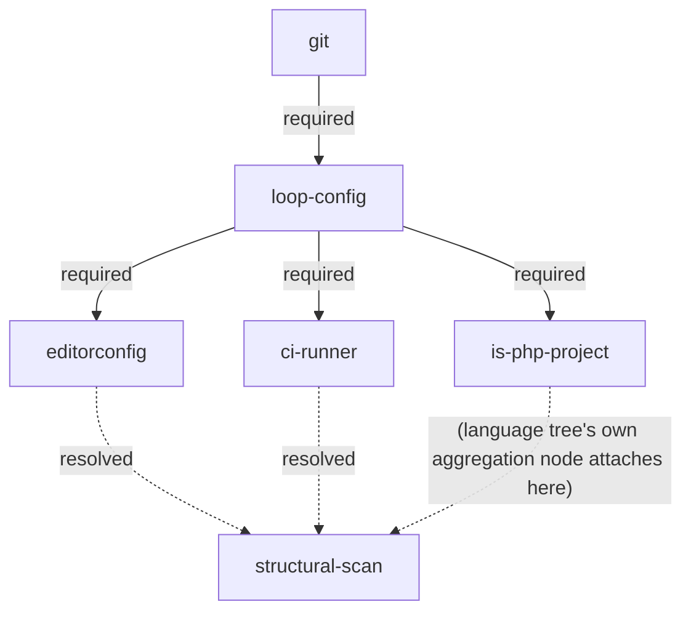

# Tooling Tree

The generic root of every language specialization's **tooling tree**. Two ordinary prerequisites (`git`, `loop-config`), one **recognition gate** per language specialization (PHP: `is-php-project`, below — a future CSS/JS specialization adds its own sibling the same way), one ordinary language-neutral first-wave node (`ci-runner`, below), and one downstream gate (`structural-scan`). A recognition gate's *role* is generic — "should this specialization's tree even be reachable on this target" is evaluated fresh every pass regardless of which specializations exist — which is why it lives here rather than in the specialization's own tree doc, even though what a given gate actually detects (PHP files/`composer.json`, for `is-php-project`) is naturally specific to that language. `ci-runner` lives here for a different reason: its content is genuinely language-neutral, but a language tree still references it externally for the language-specific edges hanging off it — the same way `editorconfig` (also below) already works. Everything past a specialization's own recognition gate — its real tooling nodes (PHP: `skills/refactor-scan/references/php-tooling-tree.md`) — attaches beneath that gate instead of beneath `loop-config` directly, and declares its own edges into `structural-scan` itself; this document otherwise stays language-neutral. Vocabulary: `CONTEXT.md` (**node**, **required edge**, **recommended edge**, **tooling tree**).

## Diagram



Three dotted edges point into `structural-scan` above. `editorconfig -.->|resolved| ss` and `ci-runner -.->|resolved| ss` are both real — declared in this document's own edge table below, since every endpoint involved is a generic-root node. `is-php-project -.-> ss` (unlabeled) is illustrative only, standing in for the language tree's own aggregation node — the real edge (for PHP: `php-structural-scan -> structural-scan`, see `skills/refactor-scan/references/php-tooling-tree.md`'s edge table) isn't drawn here; it's anchored at `is-php-project` rather than `loop-config` because that's where the PHP tree itself now attaches (its recognition gate), not because `is-php-project` is itself a resolved-parent of `structural-scan` — it isn't, it's a `required` parent of `composer`/`php-minimal-version` only (see its own node entry below). A language specialization's own leaves no longer point directly at `ss` — they resolve into a specialization-owned aggregation node (PHP: `php-structural-scan`) which itself has exactly one `resolved` edge into `ss`. All three kinds use the `resolved` type described under `structural-scan` below, not `required` or `recommended`.

## Edges

| from (parent) | to (child) | type |
|---|---|---|
| `git` | `loop-config` | required |
| `loop-config` | `is-php-project` | required |
| `loop-config` | `ci-runner` | required |
| `loop-config` | `editorconfig` | required |
| `editorconfig` | `structural-scan` | resolved |
| `ci-runner` | `structural-scan` | resolved |

The table above is this document's own — every row here is generic-to-generic (both endpoints live in this document, `structural-scan` included). Ownership rule: an edge belongs to the file where *both* its endpoints already live as generic-root nodes; an edge with one endpoint in a language tree belongs to that language tree's own edge table instead, even when the other endpoint (`editorconfig`, `structural-scan`) lives here. `editorconfig → php-cs-fixer` is declared in `php-tooling-tree.md` under that rule (`php-cs-fixer` is a PHP-tree node). `structural-scan`'s other `resolved` edge is declared in `php-tooling-tree.md` instead: `php-structural-scan → structural-scan`, for the same reason — `php-structural-scan`'s other endpoint is a PHP-tree node, not a generic-root one. `php-structural-scan` is itself the PHP tree's own aggregation of its thirteen leaves; see `php-tooling-tree.md`'s own edge table and `php-structural-scan` node entry for the full picture. A future language specialization attaches the same way — one `<language>-structural-scan` aggregation node, one `resolved` edge into this one — rather than contributing its own leaf count directly here. `editorconfig → structural-scan` and `ci-runner → structural-scan` above are the two `resolved` edges into `structural-scan` that belong here instead, because both endpoints of each — `editorconfig`/`ci-runner` and `structural-scan` itself — are already generic-root nodes.

## Nodes

### `git`

- **Name:** Git
- **Tool:** git
- **Purpose:** version control — the loop reads history from it and delivers through it.
- **Fulfilment check:** target is a git repository.
- **MR scope:** never an MR — the only hard requirement; without it the suite does not run. If missing, `refactor-scan` stops the pass immediately and reports it; nothing is filed.

### `loop-config`

- **Name:** Refactoring Config
- **Tool:** none — this is the suite's own state, not a third-party tool.
- **Purpose:** the continuous-refactoring loop's own configuration exists in the target repo, so a pass has somewhere to read/write cadence, last-run date, and create-mode.
- **Fulfilment check:** `docs/refactoring/config.md` exists in the target repo.
- **MR scope:** one MR — create `docs/refactoring/config.md` (see `skills/continuous-refactoring/references/refactoring-config.md` for its shape; there is deliberately no stored cadence — the loop never triggers itself). Ordinary node like any other: `refactor-scan` files it as a single `refactor:candidate` issue when missing, same as a PHP tree node, and it is the only candidate filed that pass.

### `is-php-project`

- **Name:** PHP Project Recognition
- **Tool:** none — recognition-only, the tree's own gate, not a third-party tool.
- **Purpose:** a **recognition gate** — hold the PHP specialization's entire tree closed until there's a
  genuine signal the target actually uses PHP, instead of proposing its nodes (`composer` and everything
  beneath it) on every target regardless of language and relying on a human to reject each one by hand as it
  becomes reachable. One gate per specialization; this is the first (a future CSS/JS specialization adds its
  own sibling the same way). The gate's *role* is generic — evaluated fresh every pass, regardless of which
  specializations exist — even though what this particular gate detects is necessarily PHP-specific.
- **Fulfilment check:** `composer.json` (or `composer/composer.json`) present, **or** at least one `*.php`
  file anywhere in the tree, `vendor/` excluded. Deliberately not `composer.json`-only: a PHP project that
  hasn't adopted Composer yet should still open this tree — including the `composer` node
  (`skills/refactor-scan/references/php-tooling-tree.md`) that proposes adopting it in the first place.
  Re-derived fresh every pass, so a target that only later becomes a PHP project opens the tree
  retroactively — no separate mechanism needed for that.
- **MR scope:** none — never proposed as a candidate (`tooling_tree.py`'s `_NEVER_PROPOSED`, the same set
  `git` is in). Rejecting a `required` parent by hand never unblocks its children (unlike a `resolved`
  parent — see `structural-scan` below), so there is nothing to gain from a human ever filing
  `docs/refactoring/out-of-scope/is-php-project.md`: leaving it unfulfilled already does everything a
  rejection could.
- **Known gap, not fixed by this node:** `php-structural-scan`'s own `resolved` gate
  (`skills/refactor-scan/references/php-tooling-tree.md`) checks each of its thirteen leaves for "fulfilled,
  or explicitly rejected under `out-of-scope/`" — it does not understand a leaf permanently closed by an
  unfulfilled `required` ancestor as a form of resolution. A leaf gated shut by this node (e.g.
  `composer-audit`) therefore counts as neither fulfilled nor rejected there; `structural-scan` still cannot
  open via the PHP path on a non-PHP target without a human filing all thirteen leaf-level rejections by
  hand. This predates `is-php-project` (a target where a human rejected `composer` itself already hit the
  same wall, since `composer`'s own children never even got proposed to reject) and isn't worsened by it.

### `ci-runner`

- **Name:** CI Runner
- **Tool:** GitHub Actions / GitLab CI
- **Purpose:** an existing pipeline that later hosts quality jobs. Language-neutral — a CI pipeline is
  useful regardless of which language specialization (if any) ends up active, so it stays a direct
  `loop-config` child here rather than gated behind any specialization's recognition gate. Referenced
  externally by `skills/refactor-scan/references/php-tooling-tree.md` for the PHP-specific edges that hang
  off it (`ci-runner → php-minimal-version`, `ci-runner → composer-audit`) — the same way that document
  already references `editorconfig` (below) for `editorconfig → php-cs-fixer`. Also a direct `resolved`
  parent of `structural-scan` (below) in its own right — deterministic tooling settling first (this node's
  whole reason for existing in `structural-scan`'s gate) includes having somewhere for quality jobs to run
  at all, not just the language-specific tools that eventually run inside it.
- **Fulfilment check:** CI config file present; forge determined from `git remote`; unknown CI → ask, do not
  record a rejection.
- **MR scope:** pipeline file only. `composer-audit`
  (`skills/refactor-scan/references/php-tooling-tree/composer-audit.md`) is a quality-job child with two
  parents (this node + `composer`). `phpunit` and `phpstan-level-0` do not get their own two-parent
  children — once this node is fulfilled, each self-wires its own CI gate as part of its own fulfilment
  check instead.

### `editorconfig`

- **Name:** `.editorconfig`
- **Tool:** none — plain-text convention file, read by any EditorConfig-aware editor, not a runnable tool.
- **Purpose:** settle the most basic formatting conventions (indentation, charset, line endings) before a
  language specialization's own style tool introduces language-specific rules — the same way `php-cs-fixer`
  exists so "later Rector output lands styled." Language-independent, so it lives at the generic root and
  its `required` parent (`loop-config`, above) is declared in this document's own edge table. Two outgoing
  edges: `editorconfig → structural-scan` (`resolved`, see `structural-scan` below) stays in this document
  too, since `structural-scan` is itself a generic-root node; only `editorconfig → php-cs-fixer` crosses
  into a language tree (`skills/refactor-scan/references/php-tooling-tree.md`'s edge table: `editorconfig →
  php-cs-fixer` recommended), since `php-cs-fixer` is a PHP-tree node.
- **Fulfilment check:** `.editorconfig` exists at the repo root. Pure presence check, no tool run, no
  equivalent-detection nuance.
- **MR scope:** create a default `.editorconfig` when missing — one language-neutral `[*]` section, no
  per-language stanza:
  ```
  root = true

  [*]
  charset = utf-8
  end_of_line = lf
  insert_final_newline = true
  trim_trailing_whitespace = true
  indent_style = space
  indent_size = 4
  ```
  Ordinary node like any other — rejectable as `wontfix` (`docs/refactoring/out-of-scope/editorconfig.md`)
  like any other node, no special carve-out.

### `structural-scan`

- **Name:** Structural Scan
- **Tool:** none — this node represents the loop's own structural-deepening work (the `refactor-scan`/`refactor-design`/`refactor-implement`/`refactor-review` cycle applied to the target's own code), not a third-party tool.
- **Purpose:** hold structural refactoring back until deterministic tooling has had its say — static analysis and a test suite catch regressions that an agent-driven structural change could otherwise introduce silently. Deterministic tools settle first, agent-driven scanning follows.
- **Fulfilment check:** every node with a `resolved` edge into this one is **resolved** — fulfilled, or explicitly rejected and recorded under `docs/refactoring/out-of-scope/`. Three direct `resolved` parents today: `editorconfig` and `ci-runner` (both above, generic-root leaves) and the active language specialization's own aggregation node (for PHP: `php-structural-scan`, declared in `php-tooling-tree.md`, itself resolved once every one of *its* resolved-parents — the PHP tree's real leaves — is resolved). A future language specialization contributes its own aggregation node the same way, one `resolved` edge each, rather than reaching directly into this node's leaf set.
- **Edge type — read this carefully, it deviates from the standard rule:** a standard **required edge** closes the child permanently once a parent is rejected. The edges into `structural-scan` do **not** do that: a rejected leaf still counts as resolved and still unblocks this node once every other leaf also reaches a resolved state. This is deliberate — one declined tooling branch (e.g. Rector rejected as not worth it here) should not permanently forbid ever doing structural work. These edges are labelled `resolved`, never `required` or `recommended` — declared in a language tree's own edge table for its own aggregation node (PHP: `php-tooling-tree.md`), or in this document's own edge table for a generic-root leaf like `editorconfig` (above). The same `resolved` semantics apply one hop down too: a language specialization's aggregation node is itself resolved once every one of *its* own resolved-parents is resolved.
- **MR scope:** never an MR by itself — fulfilling this node just opens the gate. Once open, `refactor-scan` proposes it like any other node name; the actual codebase walk (hot spots, module/interface/depth/seam vocabulary) that turns it into one concrete candidate is `refactor-design`'s job, run only for the node the human actually picked.
