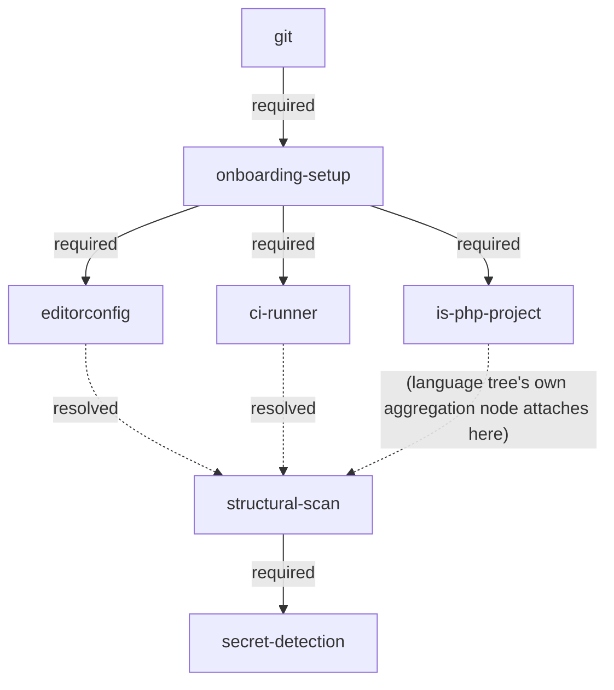

# Tooling Tree

The generic root of every language specialization's **tooling tree**. Two ordinary prerequisites (`git`, `onboarding-setup`), one **recognition gate** per language specialization (PHP: `is-php-project`, below — a future CSS/JS specialization adds its own sibling the same way), one ordinary language-neutral first-wave node (`ci-runner`, below), a downstream gate (`structural-scan`), and one **Signal wave** node gated on that downstream gate instead of on `onboarding-setup` directly (`secret-detection`, below). A recognition gate's *role* is generic — "should this specialization's tree even be reachable on this target" is evaluated fresh every pass regardless of which specializations exist — which is why it lives here rather than in the specialization's own tree doc, even though what a given gate actually detects (PHP files/`composer.json`, for `is-php-project`) is naturally specific to that language. `ci-runner` lives here for a different reason: its content is genuinely language-neutral, but a language tree still references it externally for the language-specific edges hanging off it — the same way `editorconfig` (also below) already works. `secret-detection` is language-neutral for a simpler reason — a secret scanner reads git history and file contents directly, no language-specific tooling ecosystem involved — and deliberately carries **no** `resolved` edge into `structural-scan` at all: a Signal-producing node, not a Safety Net one (see its own entry below for why), required-gated on `structural-scan` itself rather than on `onboarding-setup` so it isn't proposed before the deterministic Safety Net has closed (`CONTEXT.md`'s **Onboarding**/**Safety Net**/**Signal wave** entries). Everything past a specialization's own recognition gate — its real tooling nodes (PHP: `php-tooling-tree.md`) — attaches beneath that gate instead of beneath `onboarding-setup` directly, and declares its own edges into `structural-scan` itself; this document otherwise stays language-neutral. Vocabulary: `CONTEXT.md` (**node**, **required edge**, **recommended edge**, **tooling tree**, **signal**, **Onboarding**, **Safety Net**, **Signal wave**).

## Diagram

Three dotted edges point into `structural-scan` above. `editorconfig -.->|resolved| ss` and `ci-runner -.->|resolved| ss` are both real — declared in this document's own edge table below, since every endpoint involved is a generic-root node. `is-php-project -.-> ss` (unlabeled) is illustrative only, standing in for the language tree's own aggregation node — the real edge (for PHP: `php-safety-net -> structural-scan`, see `php-tooling-tree.md`'s edge table) isn't drawn here; it's anchored at `is-php-project` rather than `onboarding-setup` because that's where the PHP tree itself now attaches (its recognition gate), not because `is-php-project` is itself a resolved-parent of `structural-scan` — it isn't, it's a `required` parent of `composer`/`php-minimal-version` only (see its own node entry below). A language specialization's own leaves no longer point directly at `ss` — they resolve into a specialization-owned aggregation node (PHP: `php-safety-net`) which itself has exactly one `resolved` edge into `ss`. All three kinds use the `resolved` type described under `structural-scan` below, not `required` or `recommended`.

## Edges

| from (parent) | to (child) | type |
|---|---|---|
| `git` | `onboarding-setup` | required |
| `onboarding-setup` | `is-php-project` | required |
| `onboarding-setup` | `ci-runner` | required |
| `onboarding-setup` | `editorconfig` | required |
| `editorconfig` | `structural-scan` | resolved |
| `ci-runner` | `structural-scan` | resolved |
| `structural-scan` | `secret-detection` | required |

The table above is this document's own — every row here is generic-to-generic (both endpoints live in this document, `structural-scan` included). Ownership rule: an edge belongs to the file where *both* its endpoints already live as generic-root nodes; an edge with one endpoint in a language tree belongs to that language tree's own edge table instead, even when the other endpoint (`editorconfig`, `structural-scan`) lives here. `editorconfig → php-cs-fixer` is declared in `php-tooling-tree.md` under that rule (`php-cs-fixer` is a PHP-tree node). `structural-scan`'s other `resolved` edge is declared in `php-tooling-tree.md` instead: `php-safety-net → structural-scan`, for the same reason — `php-safety-net`'s other endpoint is a PHP-tree node, not a generic-root one. `php-safety-net` is itself the PHP tree's own aggregation of its nine leaves; see `php-tooling-tree.md`'s own edge table and `php-safety-net` node entry for the full picture. A future language specialization attaches the same way — one `<language>-safety-net` aggregation node, one `resolved` edge into this one — rather than contributing its own leaf count directly here. `editorconfig → structural-scan` and `ci-runner → structural-scan` above are the two `resolved` edges into `structural-scan` that belong here instead, because both endpoints of each — `editorconfig`/`ci-runner` and `structural-scan` itself — are already generic-root nodes. `structural-scan → secret-detection` also belongs here — both endpoints are generic-root nodes — and is a `required` edge, not `resolved`: `secret-detection` is a **Signal wave** node (`CONTEXT.md`), proposed only once `structural-scan` itself is open, not one of the nodes that decides *when* it opens.

## Nodes

A node's full definition lives in its own file under `tooling-tree/` (sibling to this document) — this
document's version of the per-node-file split `php-tooling-tree.md` already uses
(`php-tooling-tree`). Every node also carries a **Name** — the
human-readable label issue titles, merge requests, and chat status use instead of the node's slug. The stub
left behind here keeps Name, Tool, and Purpose inline so that label is available without opening the
extracted file; Fulfilment check, MR scope, and any further node-specific fields move to the extracted file.

### `git`

- **Name:** Git
- **Tool:** git
- **Purpose:** version control — the loop reads history from it and delivers through it.

Full definition (Fulfilment check, MR scope): `tooling-tree/git.md`.

### `onboarding-setup`

- **Name:** Onboarding Setup
- **Tool:** none — this is the suite's own state, not a third-party tool.
- **Purpose:** the continuous-refactoring loop's own state and configuration exist for this person and target, so a pass has somewhere to read/write its bookkeeping and knows its ticket-create-mode and MR-create-mode. Fulfilled by the dispatcher's onboarding step before any scan.

Full definition (Fulfilment check, MR scope): `tooling-tree/onboarding-setup.md`.

### `is-php-project`

- **Name:** PHP Project Recognition
- **Tool:** none — recognition-only, the tree's own gate, not a third-party tool.
- **Purpose:** a **recognition gate** — hold the PHP specialization's entire tree closed until there's a
  genuine signal the target actually uses PHP, instead of proposing its nodes (`composer` and everything
  beneath it) on every target regardless of language and relying on a human to reject each one by hand as it
  becomes reachable. One gate per specialization; this is the first (a future CSS/JS specialization adds its
  own sibling the same way). The gate's *role* is generic — evaluated fresh every pass, regardless of which
  specializations exist — even though what this particular gate detects is necessarily PHP-specific.

Full definition (Fulfilment check, MR scope, Known gap): `tooling-tree/is-php-project.md`.

### `ci-runner`

- **Name:** CI Runner
- **Tool:** GitHub Actions / GitLab CI
- **Purpose:** an existing pipeline that later hosts quality jobs. Language-neutral — a CI pipeline is
  useful regardless of which language specialization (if any) ends up active, so it stays a direct
  `onboarding-setup` child here rather than gated behind any specialization's recognition gate. Referenced
  externally by `php-tooling-tree.md` for the PHP-specific edges that hang
  off it (`ci-runner → php-minimal-version`, `ci-runner → composer-audit`) — the same way that document
  already references `editorconfig` (below) for `editorconfig → php-cs-fixer`. Also a direct `resolved`
  parent of `structural-scan` (below) in its own right — deterministic tooling settling first (this node's
  whole reason for existing in `structural-scan`'s gate) includes having somewhere for quality jobs to run
  at all, not just the language-specific tools that eventually run inside it.

Full definition (Fulfilment check, MR scope): `tooling-tree/ci-runner.md`.

### `editorconfig`

- **Name:** `.editorconfig`
- **Tool:** none — plain-text convention file, read by any EditorConfig-aware editor, not a runnable tool.
- **Purpose:** settle the most basic formatting conventions (indentation, charset, line endings) before a
  language specialization's own style tool introduces language-specific rules — the same way `php-cs-fixer`
  exists so "later Rector output lands styled." Language-independent, so it lives at the generic root and
  its `required` parent (`onboarding-setup`, above) is declared in this document's own edge table. Two outgoing
  edges: `editorconfig → structural-scan` (`resolved`, see `structural-scan` below) stays in this document
  too, since `structural-scan` is itself a generic-root node; only `editorconfig → php-cs-fixer` crosses
  into a language tree (`php-tooling-tree.md`'s edge table: `editorconfig →
  php-cs-fixer` recommended), since `php-cs-fixer` is a PHP-tree node.

Full definition (Fulfilment check, MR scope): `tooling-tree/editorconfig.md`.

### `secret-detection`

- **Name:** Secret Detection
- **Tool:** any secret scanner — generic, like `test-runner-if-missing`'s own `any test runner`
  (`php-tooling-tree/test-runner-if-missing.md`); a concrete tool
  (gitleaks, detect-secrets, trufflehog, …) is decided at adoption time, not pinned here.
- **Purpose:** CI-gated protection against committing secrets/credentials — a Signal-producing node
  for `refactor-prioritize`'s Select mode, not a Safety Net one. Deliberately carries **no** `resolved`
  edge into `structural-scan`, unlike its generic-root siblings `editorconfig`/`ci-runner` above:
  adopting it strengthens candidate selection (the Security signal), it never gates structural work.
  A **Signal wave** node (`CONTEXT.md`): required parent is `structural-scan` itself, not `onboarding-setup`
  — proposed only once the Safety Net has closed, not in the very first wave, so a target's earliest
  passes aren't asked to wire up a secret scanner before `phpunit`/`phpstan` even exist. Language-neutral by nature (reads git
  history/file contents directly), so it lives at the generic root rather than any language
  specialization's own tree — a future language specialization inherits it automatically, no
  re-declaration needed.
- **Signal:** Security — `../../refactor-prioritize/references/signals.md`'s own entry. Once this
  node is fulfilled, `refactor-prioritize`'s Select mode prefers a clean CI-gated scan as positive
  evidence over the generic (reading-the-code) recognition method for this factor.

Full definition (Fulfilment check, MR scope): `tooling-tree/secret-detection.md`.

### `structural-scan`

- **Name:** Structural Scan
- **Tool:** none — this node represents the loop's own structural-deepening work (the `refactor-scan`/`refactor-design`/`refactor-implement`/`refactor-review` cycle applied to the target's own code), not a third-party tool.
- **Purpose:** hold structural refactoring back until deterministic tooling has had its say — static analysis and a test suite catch regressions that an agent-driven structural change could otherwise introduce silently. Deterministic tools settle first, agent-driven scanning follows.

Full definition (Fulfilment check, Edge type, MR scope): `tooling-tree/structural-scan.md`.
